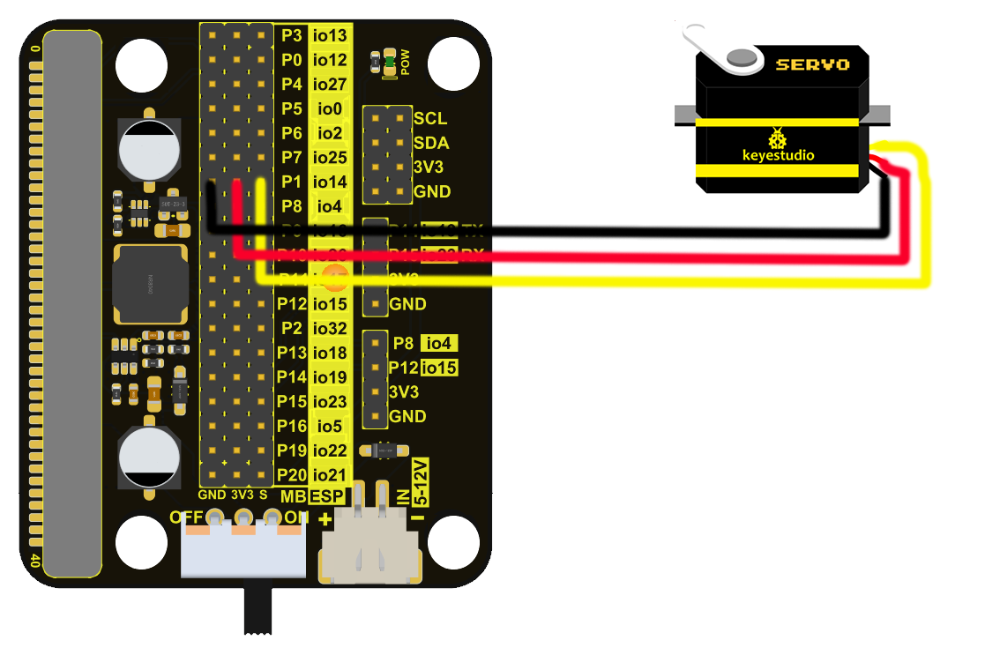

# Hand Biting Crocodile

## 1.Servo

### 1.1 Introduction

Servo is a position control rotary actuator. It mainly consists of a housing, a circuit board, a core-less motor, a gear and a position sensor. Its working principle is that the servo receives the signal sent by MCUs or receivers and produces a reference signal with a period of 20ms and width of 1.5ms, then compares the acquired DC bias voltage to the voltage of the potentiometer and obtains the voltage difference output.

In general, servo has three wires: brown, red and orange. The brown wire is grounded, the red one is a positive pole wire and the orange one is a signal  wire.

The rotation angle of servo is controlled by regulating the duty cycle of PWM (Pulse-Width Modulation) signal. The standard cycle of PWM signal is 20ms (50Hz). Theoretically, the width is distributed between 1ms-2ms, but in fact, it's between 0.5ms-2.5ms. The width corresponds the rotation angle from 0° to 180°. 

### 1.2 Specification

Working voltage: DC 3.3V~5V

Operable angle range: approximately 180° (at 500→2500 μsec)

Pulse width range: 500→2500 μsec

No-load speed: 0.12±0.01 sec/60 (DC 4.8V) 0.1±0.01 sec/60 (DC 6V)

No-load current: 200±20mA (DC 4.8V) 220±20mA (DC 6V)

Stopping torque: 1.3±0.01kg·cm (DC 4.8V) 1.5±0.1kg·cm (DC 6V)

Stop current: ≦850mA (DC 4.8V) ≦1000mA (DC 6V)

Standby current: 3±1mA (DC 4.8V) 4±1mA (DC 6V)

### 1.3 Wiring Diagram

| Expansion Board |    Servo    |
| :-------------: | :---------: |
|       GND       | G（Brown）  |
|       3V3       |  V（Red）   |
|      io16       | S（Yellow） |

### 1.4 Code

Note: The rotation angle of the servo is 0-180 degrees, but if the crocodile has been assembled, the angle must be rotated between 55-130 degrees, otherwise the servo will get hot and burn out.

**Code File：**

Download link：[Download](.\Code\BitingCrocodileTutorialCodes.zip)

Download the code file and unzip it, then double-click `1-Servo_Code1.sb3` to open the file and upload the code.

**Add code manually：**

1.Drag out the `when Arduino begin` module from `Events`.

2.Drag out the `forever` module from the `Control` and place it under the `when Arduino begin` module.

3.Tapto find and load servo，then tap “Back”（Details of loading modules are in the development board basic tutorial).

4.Drag out the servo angle module from the `Servo` , set the pin to IO14, the angle to 110 degrees, and the time to 1000ms, then place it in the `forever` module.

5.Drag out the servo angle module from `Servo`, set the pin to IO14, the angle to 90 degrees, and the time to 1000ms, and place it below the previous servo angle module.

6.Drag out the servo angle module from `Servo`, set the pin to IO14, the angle to 55 degrees, and the time to 1000ms, and place it below the previous servo angle module, then tap  to upload the code.

### 1.5 Test Result

After uploading the code, the crocodile will open its mouth for 1s, then close half of its mouth for 1s, and then completely close its mouth. 

### 1.6 Extended Tutorial

Earlier we have controlled the crocodile to open and close its mouth at a wide angle, so how to control the crocodile to slowly close and open its mouth?

#### 1.6.1 Code

**Code File：**

Download link：[Download](.\Code\BitingCrocodileTutorialCodes.zip)

Download the code file and unzip it, then double-click `1-Servo_Code2.sb3 ` to open the file and upload the code.

**Add code manually：**

1.Drag out the `when Arduino begin` module from `Events`.

2.Drag out the `forever` module from the `Control` and place it under the `when Arduino begin` module.

3.Drag out the `repeat` module from `Control` , set the repeat value to 55, then place it in the `forever` module.

4.Drag out the declare variable module from `Variable Type` , set the variable Type to int, Name to angle, Assigned to to 55, and place it under the `when Arduino begin` module.

5.Drag out the variable ++ module from  `Variable Type`, set Name to angle, and add it in the `repeat` module.

6.Drag out the servo angle module from `Servo`, set servo PIN# to IO14, degree to the variable module in the `Variable Type` , variable name to angle, delay to 30 (ms), then place it under the variable ++ .

7.Click on the `repeat` module, then right-click and click "Duplicate", then place it under the `repeat` module.

8.Modify the variable ++ module to the variable -- module. Click the ++ area to switch it.

**Complete Code：**

#### 1.6.2 Test Result

After uploading the code, the crocodile will slowly open its mouth and then slowly close it.

## 2.Ultrasonic Module

### 2.1 Introduction

The HC-SR04 ultrasonic sensor uses sonar to determine distance to an object like what bats do. It offers excellent non-contact range detection with high accuracy and stable readings in an easy-to-use package. It comes with an ultrasonic transmitter and a receiver.

It is being used in a wide range of electronics projects for creating obstacle detection and distance measuring application as well as various other applications.

### 2.2 Specification

Working voltage:3.3-5V 

Quiescent current: <2mA

Working current: 15mA

Effective angle: <15°

Distance range: 2cm – 400 cm

Accuracy: 0.3 cm

Measuring angle: 30 degrees

Trigger input pulse width: 10 microseconds

### 2.3 Wiring Diagram

| Expansion Board | Module |
| :-------------: | :----: |
|       GND       |   G    |
|       3V3       |   V    |
|    P8 / io4     |  Trig  |
|   P12 / io15    |  Echo  |

### 2.4 Code

Note: The measuring distance of ultrasonic is 2-300cm, but after being assembled on the crocodile, it can only detect 4-30cm. For the ultrasonic receives the bounced signal at a certain angle, but the basswood board of the crocodile body blocks it. As a result, only 30cm can be recognized, but this does not affect our hand biting crocodile tutorial.

**Code File：**

Download link：[Download](.\Code\BitingCrocodileTutorialCodes.zip)

Download the code file and unzip it, then double-click `2-Ultrasonic_Code.sb3 ` to open the file and upload the code.

**Add code manually：**

1.Drag out the `when Arduino begin` module from `Events`.

2.Drag out the `forever` module from the `Control` and place it under the `when Arduino begin` module.

3.Drag out the serial begin baudrate module from the `Serial` , set begin baudrate to 9600, and then place it under the `when Arduino begin` module.

4.Drag out the declare variable module from `Variable Type` , set the variable Type to int, Name to distance, Assigned to to 0, and place it under the begin baudrate module.

5.Drag out the set variable by module from the `Variable Type`, change the variable name to "distance", and then place it in the `forever` module.

6.Drag out the read ultrasonic distance module from the `Ultrason`, set the trig pin to IO4, the echo pin to IO15, the read distance to cm, and then place it in the white box of the set variable by module.

7.Drag out the serial print module from the `Serial` , set the print mode to "warp", and then place it under the set variable by module.

8.Drag out the `variable` module from the `Variable Type` , change the variable name to distance, and then place it in the white box of the serial print module.

9.Drag out the delay module from the `Control`, set the delay to 0.3, and then place it under the serial print module.

### 2.5 Test Result

After uploading the code, click on the serial port printing area in the upper right corner as shown in the figure, then click on the to set the baud rate to 9600.

After the setting is completed, we can see the distance sensed by the ultrasonic in the serial port printing area. The serial port printing distance will be printed every 0.3s.

## 3.Buttons Control the Crocodile 

### 3.1 Introduction

In this project, we work to control the crocodile to open and close its mouth through the AB buttons on the ESP32 Easy Coding Board.

### 3.2 Code

**Code File：**

Download link：[Download](.\Code\BitingCrocodileTutorialCodes.zip)

Download the code file and unzip it, then double-click`3-Key_controlled_crocodile_Code.sb3 `to open the file and upload the code.

**Add code manually：**

1.Add the `when Arduino begin` module and initialize the state of the RGB dot matrix and servo with an open mouth.

2.Drag the if then code block from the `Control` and place it in the `forever` module, set the judgment condition to whether button A is pressed, and add the RGB dot matrix display red crying face code and the servo rotate to 55 degree code to the if then code block. 

3.Copy the first if then code, then modify the RGB dot matrix to display a green smiley face, and rotate the servo to 110 degrees.

**Complete Code：**

### 3.3 Test Result

After the code is uploaded successfully, press the button A and the crocodile will display a red crying face and close its mouth. Press the button B and the crocodile will display a green smile and its mouth will open.

## 4.Hand Biting Crocodile

### 4.1 Introduction

The crocodile opens its mouth. When you put your hand into the crocodile's mouth, the ultrasonic on the crocodile will measure the depth of your hand into the crocodile's mouth. When it reaches the depth we set, the crocodile will bite.

### 4.2 Code

**Code File：**

Download link：[Download](.\Code\BitingCrocodileTutorialCodes.zip)

Download the code file and unzip it, then double-click`4-Crocodile_Bite_Code.sb3`to open the file and upload the code.

**Add code manually：**

1.Set the baud rate to 9600 during initialization, declare two int type variables distance (distance is used to store the distance measured by ultrasonic) and item (item is used to store randomly generated values). The initial value of item is 5, and the servo angle is set to 110 degrees, the RGB dot matrix displays a green smiley face.

2.Add the distance measured by ultrasonic to the distance variable in `forever`. Use the serial port printing module to print characters no-wrap for distinction, and then wrap the proofing data so that characters and values can be printed on one line. The delay is 0.2s.

3.Use the if then module to compare the values in distance and item. If the value in distance is less than the value in item, the code in the if then module will be executed. Use the randomly generated value module and set it to randomly generate a number between 3-9 so that you can achieve the random effect of hand biting crocodile. The initial value of time is 5 and the next value is randomly generated. 

Add the RGB dot matrix to display the red crying face code, and then add the code for the servo to select an angle of 55 degrees so that the crocodile bites. After a delay of 3s, the servo rotates to 110 degrees and the crocodile opens its mouth, and then the RGB dot matrix displays a green smile. The delay is 1.5s.

**Complete Code：**

### 4.3 Test Result

After the code is successfully uploaded, the crocodile opens its mouth, and the RGB dot matrix displays a green smile. When the distance between the hand and the ultrasonic meets the crocodile's bite conditions, the crocodile bites and the RGB dot matrix displays a red crying face. The crocodile releases its mouth after 3s of bite. And the RGB dot matrix displays a green smiley face, the final 1.5s delay is to prepare for retracting the hand from the crocodile's mouth. After 1.5s, it enters the next hand-biting process.

