# BBC Micro:bit

## 1.Micro:bit是什么?

Micro:bit是由ARM、巴克莱、element14、微软等机构与英国广播公司（BBC）合作推出的一款基于ARM架构的开源硬件平台，核心设备是32位Arm Cortex-M4带有FPU的微处理器，Micro:bit主板只有信用卡一半大小，但功能非常强大。Micro:bit V2.0主板拥有丰富的板资源，搭载了5×5可编程LED点阵、2颗可编程按键、加速度计、电子罗盘、温度计、可触摸感应的Logo、MEMS麦克风、低功耗蓝牙等电子模块，背面还有一个蜂鸣器，可以在没有外部设备的情况下也可以播放各种声音。此外，Micro:bit主板还支持休眠模式，用户可以长按Micro:bit主板后面的复位&电源按钮，使进入睡眠模式，降低电池功耗。
Micro:bit开发板的功能强大，具有易用性和扩展性，底部齿轮设计的金手指，它可以很好的通过固定鳄鱼夹与各种电子元件互动。支持读取传感器数据，控制舵机与RGB灯带等，也可以插入扩展板连接各种传感器。Micro:bit支持多种代码及图形化编程平台，支持几乎所有的PC和移动设备，具有免安装驱动，电子模块集成度高，且带有串口监控功能，方便调试！
Micro:bit应用非常广泛，可以用于编写电子游戏，声光互动，机器人控制，科学实验，可穿戴装置开发等，可以实现任何酷炫的小发明，无论是机器人还是乐器，没有做不到只有想不到。创造更多的创意作品。

------

### 1.1Micro:bit V2主板硬件分布图介绍：

------

### 1.2Micro:bit V2引脚配置介绍，如下图所示：

Micro:bit引出的引脚中，其引脚功能分类如下表所示：

|     功能      |                             引脚                             |
| :-----------: | :----------------------------------------------------------: |
|     GPIO      | P0，P1，P2，P3，P4，P5，P6，P7，P8，P9，P10，P11，P12，P13，P14，P15，P16，P19，P20 |
|    ADC/DAC    |                   P0，P1，P2，P3，P4，P10                    |
|      IIC      |                    P19（SCL），P20（SDA）                    |
|      SPI      |             P13（SCK），P14（MISO），P15（MOSI）             |
|  PWM（常用）  |                   P0，P1，P2，P3，P4，P10                    |
| PWM（不常用） |  P5、P6、P7、P8、P9、P11、P12、P13、P14、P15、P16、P19、P20  |
|    已占用     | P3(LED Col3)，P4(LED Col1)，P5(Button A)，P6(LED Col4)，P7(LED Col2)，P10(LED Col5)，P11(Button B) |

 详细信息请参考官方网站：[Microbit hardware](https://tech.microbit.org/hardware/edgeconnector/)

https://microbit.org/guide/hardware/pins/

------

### 1.3Micro:bit主板使用注意事项：

-  Micro:bit主板上有很多精密的电子元件，建议戴上硅胶保护套进行使用，防止短路。
-  Micro:bit主板的IO口驱动能力很弱，IO口电流不足300mA，请勿接大电流器件（例如大舵机MG995、直流电机），否则会烧坏Micro:bit主板，使用前必须完全了解清楚你所使用的器件电流情况，一般建议配搭Micro:bit扩展板进行使用。
-  供电建议从Micro:bit主板的USB口进行供电，或者Micro:bit主板上的3V电池座接口。Micro:bit主板本身IO口是3V电平，所以是不支持5V传感器的，如需支持5V传感器需要使用 Micro:bit扩展板。
-  使用与Micro:bit主板LED点阵的共用引脚（如P3、P4、P6、P7、P10），记得在代码中把LED点阵禁用掉，否则会有LED点阵乱亮的现象。
-  不要使用IO 口P19、P20，P19和P20是不能当做IO口来使用的，虽然makecode软件上显示可以使用，实际是用不了的！只能用于I2C通讯。
-  3V电池座接口上不能使用超过3.3V电池，插上去很容易会把Micro:bit主板烧坏。
-  禁止放在金属制品上使用，以免发生短路。

**总之：**Micro:bit主板就像是一台微型计算机，它使编程变得有形，并促进数字创造力。关于编程环境，BBC提供了一个在线编程网站：<https://microbit.org/code/> 该网站有一个易于使用的图形化程序MakeCode。

------

## 2.Micro:bit驱动安装说明

**micro:bit是可以免安装USB驱动的，如果你的电脑识别不了micro:bit主板，则需要安装一下micro:bit驱动。**

**驱动安装：**

**（网盘会存放对应教程驱动文件，请自行下载）**

首先将micro:bit主板用micro USB数据线连接到电脑上

然后鼠标左键双击驱动文件，点击Install。

------

------

继续点击Install，安装驱动。

------

先点击“Install”，再点击“Finish”，安装完成。

------

------

安装完成后，点击“Computer” —>“Properties”—> “Device manager”,我们可以看到下图。

------

## 3代码与编程

以下的步骤说明基于Windows 操作系统，如果你使用的是其他操作系统，可以将其作为参考。

### 3.1快速开始

本节介绍如何为micro:bit编写程序以及如何将其下载到micro:bit主板。micro:bit官方网站上有非常详细的教程，你可以参考：<https://microbit.org/guide/quick/>

#### 3.1.1Step 1: 连接Micro:bit主板

通过Micro USB线将micro:bit 主板连接到电脑，（使用移动动设备对micro:bit进行编码，请移步查看：<https://microbit.org/get-started/user-guide/mobile/>） Macs、PCs、 Chromebooks and Linux系统（包括Raspberry Pi）都支持micro:bit主板。

------

micro:bit主板背后的红色LED指示灯会显示micro:bit 主板有电了，不管是电池还是micro USB数据线。在micro:bit主板上，当你的电脑通过micro USB与micro:bit主板通信时，黄色LED指示灯会闪烁，例如当你正在烧入一个“hex”程序文件时。

Micro:bit主板将在你的电脑上显示为一个名为'MICROBIT'的驱动器。但请注意，它不是普通的USB磁盘！如下图：

------

#### 3.1.2Step 2: 编写程序：

在浏览器中访问链接：<https://makecode.microbit.org/>，然后单击“新建项目”，出现“创建项目”对话框，在对话框中输入“heartbeat”，单击“创建 √”并开始编程。
如果你的电脑具有Windows 10操作系统，则还可以使用Windows 10 App进行编程，这与在浏览器上进行编程完全相同。Windows 10 App下载链接：[https://www.microsoft.com/](https://www.microsoft.com/zh-cn/p/makecode-for-micro-bit/9pjc7sv48lcx?ocid=badgep&rtc=1&activetab=pivot:overviewtab)
（以下是以Google Chrome为例，其他浏览器类似）

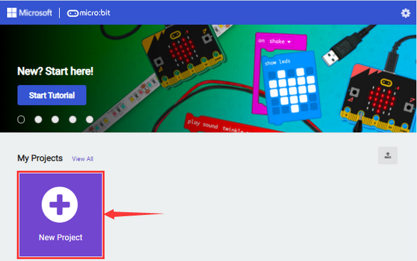

------

编写一个micro:bit代码。 例如，从模块区拖放一些指令方块放入代码编辑区，然后在MakeCode编辑器中的Simulator上尝试你的程序，如下图（和视频）所示，该图（和视频）显示了如何对heartbeat进行编程。

下一节将进一步介绍Makecode。

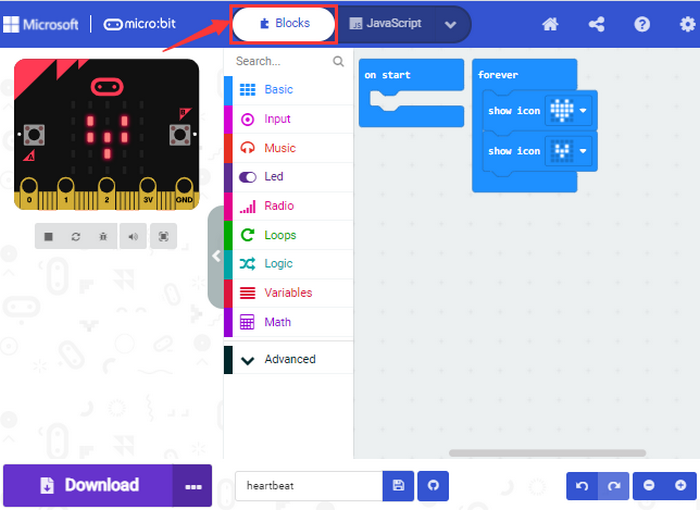

------

点击“ JS JavaScript”，你可以看到对应的JavaScript语言代码程序，如下图：

------

你还可以点击“ JSJavaScript”，再点击下拉按钮选择“Python”，你还可以看到对应的Python语言代码程序，如下图：

------

#### 3.1.3Step 3: 下载代码：

如果使用Windows 10 App编写程序，则只需单击“下载”按钮，该代码程序将直接下载到micro:bit主板，而无需任何其他操作。 
如果使用浏览器编写程序，请按照以下步骤操作： 
单击编辑器中的“下载”按钮。 这将下载一个“hex”文件，该文件是micro:bit主板可以读取的格式。十六进制文件下载后，将其复制到你的micro:bit 主板，就像将文件复制到USB驱动器一样。 在Windows上，你还可以右键单击并选择“发送到→MICROBIT”将“hex”文件拷贝到micro:bit主板。 

------

也可以将“hex”文件直接拖入MICROBIT磁盘中。

将下载好的“hex”文件拷贝到micro:bit 主板过程中，micro:bit主板背面的黄色信号灯会闪烁，当拷贝完成后黄色信号灯停止闪烁，保持长亮。

#### 3.1.4Step 4: 运行程序：

将代码程序上传micro: bit主板后，通过micro USB线或外接电源给micro: bit主板供电，micro: bit主板上5 x 5 可编程LED点阵显示heartbeat的图案。

USB供电：

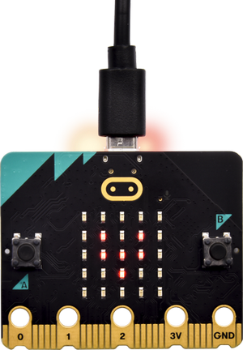

------

外接3V电源供电：

警告：
每次编程时，MICROBIT驱动器都会自动弹出并返回，但是你的十六进制（hex）文件将会消失。 micro:bit主板只能接收十六进制（hex）文件，不会存储任何其他文件！

------

#### 3.1.5Step5：掌握：

本小节向你展示了如何开始使用micro:bit主板，但是除了MakeCode图形化编程之外，你还可以使用其他语言来编写micro:bit的程序代码。转到链接：<https://microbit.org/code/>查看不同的语言编程，或查看链接：<https://microbit.org/projects/>，了解你可能想要尝试的一些内容。

### 3.2Makecode

在Google Chrome访问链接：<https://makecode.microbit.org/>，打开makecode在线版本。或打开 Windows 10 App makecode版本。 

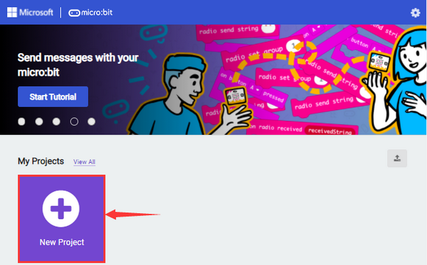

------

点击 “New Project”,出现“创建项目”对话框，在对话框中输入“heartbeat”，单击“创建 √”进入Makecode 编译器，Makecode 编译器如下: 

在代码编辑区中，有两个固定的指令方块“on start”和“forever”。 
上电或复位后，“on start”指令方块中的代码将仅执行一次；并且“forever”指令方块中的代码将循环执行。

------

### 3.3快速下载

如前所述，如果使用makecode的Windows 10 App，则可以通过单击“下载”按钮将代码快速下载到micro:bit主板。 
使用makecode的浏览器版本可能需要更多步骤。但是，如果你将Google Chrome用于Android，ChromeOS，Linux，macOS和Windows 10系统，则可以实现快速下载功能。 
在这里，我们使用Chrome的webUSB功能，该功能允许网页访问你的micro USB硬件设备。 我们将按照以下步骤完成micro:bit设备与网络连接和配对。 如前所述，如果使用makecode的Windows 10 App，则可以通过单击“下载”按钮将代码快速下载到micro:bit主板。 
使用makecode的浏览器版本可能需要更多步骤。但是，如果你将Google Chrome用于Android，ChromeOS，Linux，macOS和Windows 10系统，则可以实现快速下载功能。 
在这里，我们使用Chrome的webUSB功能，该功能允许网页访问你的micro USB硬件设备。 我们将按照以下步骤完成micro:bit设备与网络连接和配对。

**配对装置：**

用micro USB线连接电脑和micro:bit主板。 

------

单击“下载”后面的“...”，然后单击“Connect device”。

------

然后继续单击“Next”按钮。

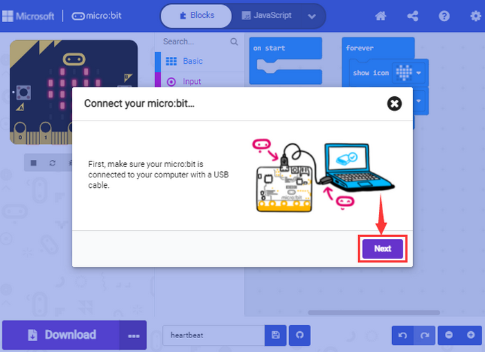

------

再继续单击“Next”按钮。

------

在弹出窗口中选中对应的“设备”，然后单击“连接”按钮。 如果弹出窗口中没有设备，请参考以下内容：<https://makecode.microbit.org/device/usb/webusb/troubleshoot>
当然，如果你不想点击链接进入相关页面中查看，你也可以在本教程的文件夹中直接阅读“用WebUSB排除下载过程中的故障.pdf”。 
如果你的micro:bit主板出现问题是需要更新micro:bit的固件，在本教程的文件夹“如何更新Micro:bit主板的固件”中的文件“如何更新micro:bit主板的固件.pdf”介绍了如何更新micro:bit的固件，其内容来自：<https://microbit.org/guide/firmware/>

------

单击“Done”，设备连接成功。

------

**程序下载：**

设备连接成功后，单击“下载”按钮，程序将直接下载到Micro:bit主板，如果程序成功下载到Micro:bit主板上，下载按钮会变成

------

### 3.4Makecode扩展库示例

#### 3.4.1添加扩展库文件

您可以通过以下方法添加扩展库文件。 
打开makecode，在任何项目下，先点击右上角的齿轮图标（设置），再点击Extensions。

------

或者单击Advanced下的Extensions。

------

可以选择通过搜索或者网址来选择扩展库。

------

例子：想要控制舵机，则搜索servo，出现了很多库，选择我们想要的库即可。

------

此时，模块栏就会出现Servos库，可以控制舵机了。

------

#### 3.4.2更新或删除扩展库

点击 **Js JavaScript** 按钮切换到文本代码。

------

点击左边的Explorer. 

------

在扩展列表中找到扩展库文件。单击垃圾箱图标以删除Servos扩展库文件。

------

选择Remove it即可删除。

------

再点击Blocks，切换回图形化编程。

------

------

### 3.5资源和代码

该教程的资源和代码都可以在此下载链接中下载：

下载链接：https://fs.keyestudio.com/KS0801

#### 3.5.1导入代码

我们为每个项目提供十六进制代码文件（项目文件）。十六进制代码文件包含项目的所有内容，可以直接导入，你也可以手动拖动代码块来完成每个项目的代码程序。如果选择通过手动拖动代码块来完成项目代码，则可能需要添加必要的扩展库。

**对于简单项目，建议通过拖动代码块来完成项目。** 

**对于复杂的项目，建议通过导入我们提供的十六进制代码文件来完成项目.** 

接下来，我们以“ Heatbeat”项目为例，介绍如何加载代码。 

打开Web版本的makecode或Windows10 APP版本的makecode，单击“Import”。

------

在弹出的对话框中，单击“导入文件”。

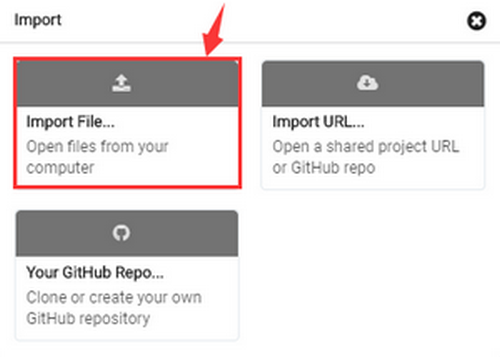

------

打开刚才下载的代码“Heart beat.hex”

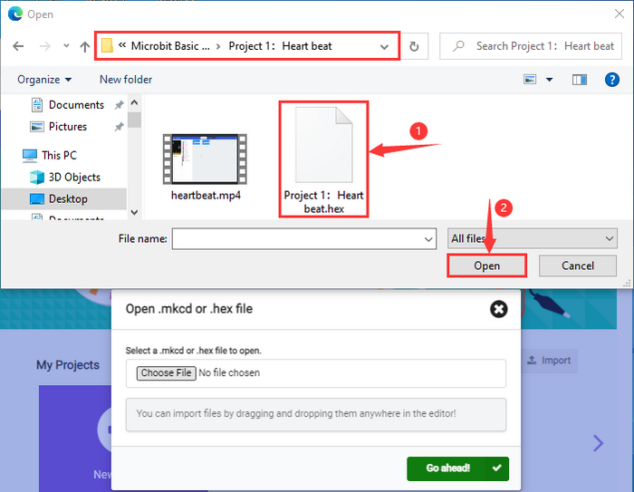

------

除了上述将提供的项目代码程序文件直接导入到Makecode编译器中的方法之外，也可以将我们提供的项目代码程序文件直接拖入到Makecode编译器中的代码编辑区，如下图所示：

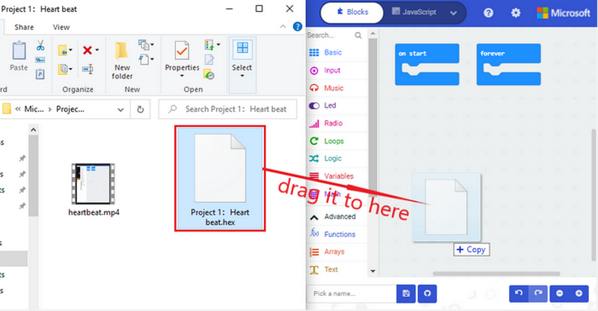

------

几秒钟后，项目成功加载。

注意：如果你的电脑系统是Windows7/8而不是Windows 10，则在Google Chrome中是无法进行设备配对，从而读取不了一些传感器/模块的数字信号或模拟信号，可是又需要读取相应的传感器/模块的数字信号或模拟信号，那怎么办呢？这里就可以使用CoolTerm软件来读取串口数据的，下面是CoolTerm安装方法。

------

#### 3.5.2CoolTerm软件安装

这里需要安装CoolTerm程序软件，CoolTerm程序软件是用来在下面的一些实验中读取串口通讯的，这里我们提供了CoolTerm程序软件的下载链接：<https://freeware.the-meiers.org/>

1. 现在，让我们来安装CoolTerm程序软件，这里我们是以PC Windows系统为例，选择下载安装CoolTerm Win，下载后解压并打开。（Mac系统和 Linux系统也类似）
    
    
    ------
    
    
    
2. 双击打开（注意：必须保证micro:bit驱动已安装和micro:bit主板连接到电脑上）

    

    ------

    

3. The functions of each button on the Toolbar are listed below: 

    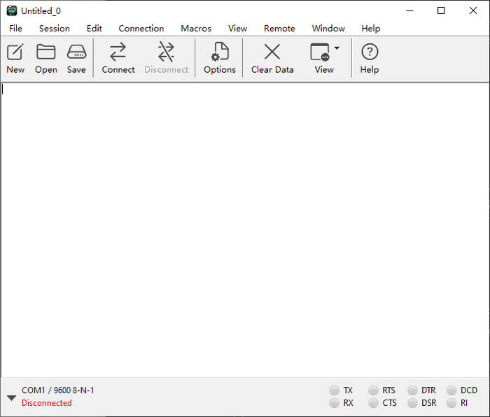

|          Icon           |                     Function                     |
| :---------------------: | :----------------------------------------------: |
|  |             Opens up a new Terminal              |
|  |             Opens a saved Connection             |
| 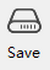 |       Saves the current Connection to disk       |
|  |           Opens the Serial Connection            |
|  |           Closes the Serial Connection           |
|  |             Clears the Received Data             |
|  |       Opens the Connection Options Dialog        |
|  | Displays the Terminal Data in Hexadecimal Format |
|  |             Displays the Help Window             |

  

------

## 4.Micro:bit基础课程

### 4.1 Project 1: 闪烁心

#### 1.实验介绍:
这个项目很简单，你可以用一个micro:bit主板、一根Micro USB线和电脑就可以实现的，首先在micro:bit LED点阵上显示一个大的“心”，然后显示小的“心”，这个循环看起来就像心跳。这也是一个入门实验，让你进入micro:bit的编程世界。

#### 2.所需组件:

| Micro:bit主板*1 |  |
| --------------- | ---------------------- |
| Micro USB 线*1  |  |

#### 3.实验接线:
通过micro USB线将micro:bit主板连接到你的电脑上。

#### 4.示例代码:
（教程附带的资源文件中，找到Project 1代码文件夹）

可以打开这个链接: <https://makecode.micro:bit.org/reference> 来了解更多关于micro: bit blocks的信息。
然后可以直接进入链接：<https://makecode.micro:bit.org/>，编辑你的项目代码，如下：

**寻找指令方块：**

**组合指令方块：**

点击micro: bit在线编程工具的“JSJavaScript”,你可以看到对应的JavaScript语言代码程序：

点击micro: bit在线编程工具的“JSJavaScript”后面的下拉按钮，选择“Python”，你可以看到对应的Python语言代码程序：

------

#### 5.实验现象:

按照之前的方式将示例代码下载到micro:bit主板，利用micro USB数据线上电，micro:bit主板上的LED点阵屏切换显示“❤”图案和“”图案，循环进行。   [How to download?  How to quick download?](#3.1.3Step 3: 下载代码：)

**如果存在下载问题，请断开micro USB线和Micro:bit主板连接，然后重新连接它们并重新打开Makecode，以尝试再次下载。**

### Project 2: 单个LED闪烁

#### 1.实验介绍:
在这个项目中，我们尝试控制micro:bit主板上的LED点阵中的某个LED闪烁效果。 

#### 2.所需组件:

| Micro:bit主板*1 |  |
| --------------- | ---------------------- |
| Micro USB 线*1  |  |

#### 3.实验接线:
通过micro USB线将micro:bit主板连接到你的电脑上。

#### 4.元件介绍：
Micro:bit主板的LED点阵共由25个发光二极管组成，5个一组，分别对应X和Y方向，形成一个5×5的矩阵，且每个发光二极管是放置在行线（X）和列线（Y）的交叉点上，我们可以通过设置坐标点来实现对25个LED中某一个LED的控制。
例如，想要LED点阵中第1行第1个LED点亮，可以设置坐标点为（0，0）；第1行第3个LED点亮，可以设置坐标点为（2，0）；第1列第5个LED点亮，可以设置坐标点为（0，4）；第3列第2个LED点亮，可以设置坐标点为（2，1），依此类推。

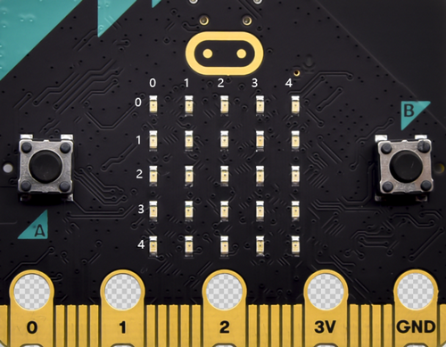

#### 5.示例代码:

**寻找指令方块：**

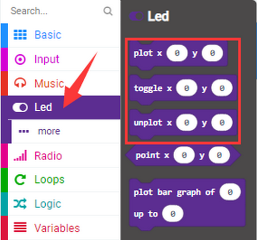

------

**组合指令方块：**

------

#### 6.实验现象:

按照之前的方式将示例代码下载到micro:bit主板，利用micro USB数据线上电，可以看到坐标点(1,0)的LED的闪烁，持续1s，接着切换到坐标点(3,4)的LED闪烁，持续1s。循环进行。   [How to download?  How to quick download?](#3.1.3Step 3: 下载代码：) 

### Project 3: LED点阵显示

#### 1.实验介绍:
点阵在我们生活中很常见，很多都有用到它，比如LED广告显示屏，电梯显示楼层，公交车报站等等。
Micro:bit主板的LED点阵共由25个发光二极管组成，上一课我们已经讲过通过设置坐标点来实现对LED点阵的25个LED中的某个LED的控制，这样可以通过设置多个坐标点控制多个LED的亮灭使得LED点阵能够显示图案、数字、字符串。我们也可以在特定代码中通过点击 LED点阵的灰白色小正方形点亮 LED点阵对应的LED来实现LED点阵显示图案、数字、字符串。除了上述方法还可以使用自定义图案使LED点阵显示图案。

#### 2.所需组件:

| Micro:bit主板*1 |  |
| --------------- | ---------------------- |
| Micro USB 线*1  |  |

#### 3.实验接线:
通过micro USB线将micro:bit主板连接到你的电脑上。

#### 4.示例代码:

寻找指令方块：

------

组合指令方块：

------

#### 5.实验现象:
按照之前的方式将示例代码下载到micro:bit主板，利用micro USB数据线上电，我们就可以看到micro:bit主板的5×5 LED点阵开始显示数字1、2、3、4、5，然后循环显示“向下”图案、字符串“Hello!”、“心”图案、“东北”方向图案、“东南”方向图案、“西南”方向图案和“西北”方向图案！    [How to download?  How to quick download?](#3.1.3Step 3: 下载代码：) 

### Project 4: 可编程按键

#### 1.实验介绍:
按键可以控制电路的通断，把按键接入电路中，不按下按键的时候电路是断开的，一按下按键电路就通啦，但是松开之后就又断了。
Micro:bit主板有三个按键，反面的是复位按钮，正面的是两个可编程按键，通过对两个可编程按键组合可以有三种组合，作为输入元件。我们结合上节课的LED点阵，一起来学习按键吧。我们做一个按键三连，分别按A、B和AB同时按，对应显示屏分别显示A、B和AB。

#### 2.所需组件:

| Micro:bit主板*1 |  |
| --------------- | ---------------------- |
| Micro USB 线*1  |  |

#### 3.实验接线:

通过micro USB线将micro:bit主板连接到你的电脑上。

#### 4.示例代码1:

寻找指令方块：

------

组合指令方块：

------

#### 5.实验现象1:

按照之前的方式将示例代码1下载到micro:bit主板，利用micro USB数据线上电，按下micro:bit主板上正面按键A且松开，我们可以看到5×5 LED点阵显示字符“A”；按下micro:bit主板上正面按键B且松开，我们可以看到5×5 LED点阵显示字符“B”，同时按下micro:bit主板上正面按键A和B且都松开，我们就可以看到5×5 LED点阵显示字符“AB”。   [How to download?  How to quick download?](#3.1.3Step 3: 下载代码：) 

#### 6.示例代码2:

寻找指令方块：

------

------

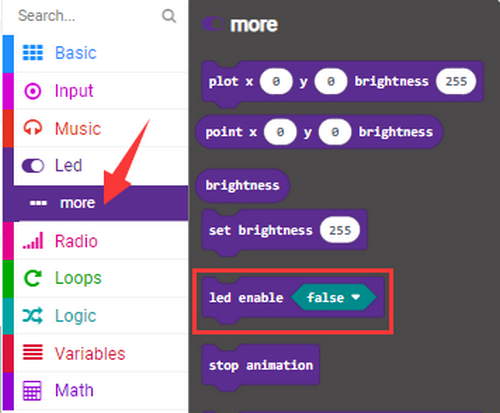

------

------

------

组合指令方块：

------

#### 7.实验现象2:
按照之前的方式将示例代码2下载到micro:bit主板，利用micro USB数据线上电，按下micro:bit 主板上正面按键A，增加条形图高度，表现为LED点阵亮的行数增加；按下正面按键B，减少条形图高度，表现为LED点阵亮的行数减少。   [How to download?  How to quick download?](#3.1.3Step 3: 下载代码：) 

### Project 5: 温度检测

------

#### 1.实验介绍:
   本实验项目将介绍Micro:bit对外界温度的检测，micro:bit主板实际上并不带温度传感器，而是nNRF52833应用处理器内置的温度传感器进行温度检测，所以检测的温度更接近处理器的温度，可能与周围环境温度存在一定的误差。传感器检测范围为：-40℃~105℃。

#### 2.所需组件:

| Micro:bit主板*1 |  |
| --------------- | ---------------------- |
| Micro USB 线*1  |  |

#### 3.实验接线:
通过micro USB线将micro:bit主板连接到你的电脑上。

------

#### 4.示例代码:

寻找指令方块：

------

------

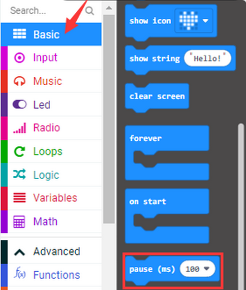

------

组合指令方块：

------

#### 5.实验现象1:
按照之前的方式将示例代码1下载至micro: bit主板，利用micro USB数据线上电，点击“显示控制台(设备)”按钮：   [How to download?  How to quick download?](#3.1.3Step 3: 下载代码：) 

------

显示串口输出数据，用手按住Micro:bit主板的nNRF52833应用处理器，一段时间后，温度开始慢慢上升，如下图所示：

------

如果你的电脑系统是Windows7/8而不是Windows 10，则在Google Chrome中是无法进行设备配对，这里需要使用CoolTerm软件来读取串口数字的。
打开CoolTerm软件，点击Options，选择SerialPort，设置COM口和波特率，波特率设置为115200（经过测试，micro:bit  主板的USB串口通讯波特率是115200），点击OK后，最后点击Connect。

------

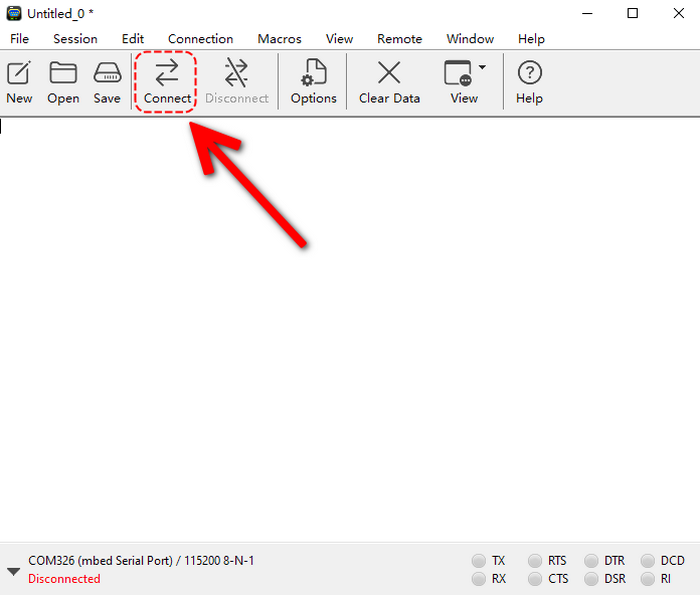

------

CoolTerm的串口监视器显示当前环境中的温度值变化，如下图：

------

#### 6.示例代码2:

寻找指令方块：

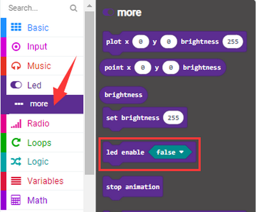

------

------

------

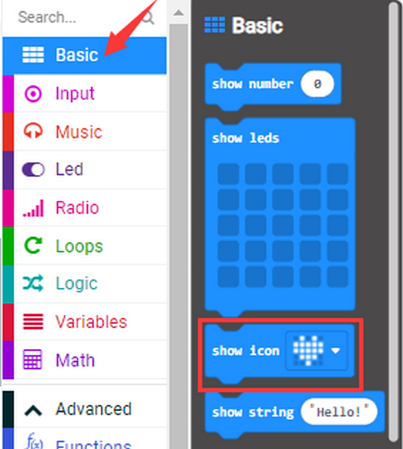

------

组合指令方块： （注意：代码中的条件值35可以根据当地实际环境情况进行更改。）

------

#### 7.实验结果2：

按照之前的方式将示例代码2下载到micro:bit主板，利用micro USB数据线上电，当外界环境中的温度小于35℃时，micro:bit主板上的LED点阵屏显示图案，用手按住micro:bit主板后面的温度传感器，当温度大于等于35℃时，LED点阵屏显示图案。    [How to download?  How to quick download?](#3.1.3Step 3: 下载代码：) 

### Project 6: 地磁传感器

------

#### 1.实验介绍：

本实验项目主要介绍micro:bit地磁传感器(磁力计)的使用，地磁传感器除了检测地磁场强度外，还能当作指南针确定方向，同时也是航姿参考系统(AHRS)的重要组成部分。micro:bit主板采用的是LSM303AGR地磁传感器，LSM303AGR包括支持标准、快速模式、快速模式plus和高速(100 kHz、400 kHz、1 MHz和3.4 MHz)的I2C串行总线接口和SPI串行标准接口与外部通信，磁场动态范围为±50 gauss。在micro:bit主板中，磁力检测、指南针积木块均用到了磁力计模块，本实验中，将先介绍指南针，然后查看磁力计原始数据。常见的指南针主要部件是一根磁针，在地磁场的作用下可以转动并指向地磁北极（地理南极附近），用来辨别方向。

**注意：micro:bit主板内部的地磁传感器（磁力计、指南针），我们可以通过读取这个磁力计的读数来判断方位，得到相对于北磁极的数值，返回值是0到360之间的数值。在磁力计首次开始工作（带到新位置后）时系统会自动要求我们对micro:bit主板校准，正确的校准方式是旋转micro:bit主板。需要注意的是，附近要是有金属物件可能会影响读数和校准准确性。**

#### 2.所需组件:

| Micro:bit主板*1 |  |
| --------------- | ---------------------- |
| Micro USB 线*1  |  |

#### 3.实验接线:
通过micro USB线将micro:bit主板连接到你的电脑上。

------

#### 4.示例代码:

寻找指令方块：

------

------

------

组合指令方块：

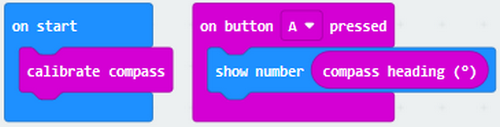

------

代码说明：首先必须对micro:bit主板进行校准，因为每个地方地磁场不同，对结果有比较大的的影响，如果是第一次使用指南针，micro:bit主板会自动提示需要校准。

#### 5.实验现象1：
按照之前的方式将示例代码1下载至micro: bit主板，micro USB数据线不要拔下来，利用micro USB数据线上电，按下micro:bit主板上正面按键A时，micro:bit主板首先提示校准，屏幕(LED点阵)提示:“TILT TO FILL SCREEN”,然后进入校准界面，校准方式为：旋转micro:bit主板，使得屏幕(LED点阵)画一个封闭的正方形（25个LED都点亮），如下图所示：

当封闭的正方形画好后，会显示一个“笑脸”图案，表示校准完成。
校准完成后，按下按键A的时候，直接在屏幕上显示磁力计的读数，北、东、南、西对应0°、90°、180°、270°。   [How to download?  How to quick download?](#3.1.3Step 3: 下载代码：) 

#### 6.示例代码2:

这个模块意思是，在循环中，不断读取磁力计的读数，并根据读数范围判断所指方向，让箭头指向当前的地磁北极。

如图所示，如果读数在292.5和337.5之间，就让显示屏显示一个指向右上方的箭头，由于代码里不能输入0.5，所以取的判断数值是293和338。之后再加入其它逻辑判断条件，就得到了完整的代码。
也可以自己通过拖动代码块来编写项目代码，如下：

寻找指令方块：

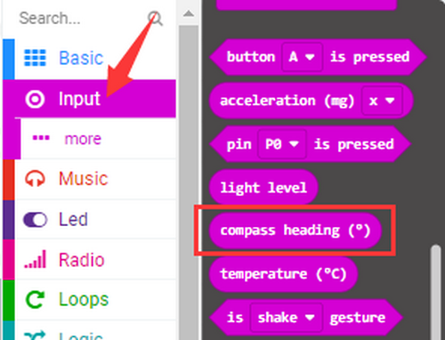

------

------

------

------

------

 组合指令方块：

 

 

 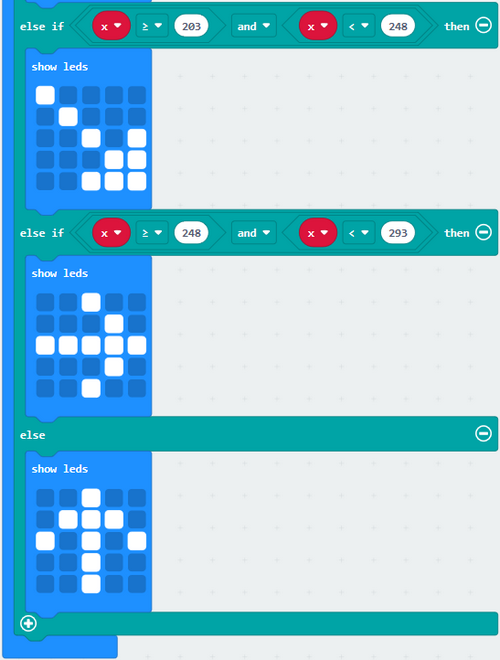

#### 7.实验现象2:
按照之前的方式将示例代码2下载到micro:bit主板，利用micro USB数据线上电，提示校准（校准方法请参考:上面示例代码1部分），校准完成后，旋转micro:bit主板，可以看到micro:bit主板上LED点阵显示方向图案。    [How to download?  How to quick download?](#3.1.3Step 3: 下载代码：) 

 ### Project 7: 加速度传感器

#### 1.实验介绍:
micro:bit主板内置有LSM303AGR加速度传感器（加速度计），LSM303AGR包括支持标准、快速模式、快速模式plus和高速(100 kHz、400 kHz、1 MHz和3.4 MHz)的I2C串行总线接口和SPI串行标准接口与外部通信，8/10/12 bits的分辨率，可设置量程为±2g、±4g,、±8g。
当micro:bit主板处于静止或匀速运动状态时，加速度计仅检测到重力加速度；将micro:bit主板轻微甩动，加速度计检测到甩动的加速度远小于重力加速度，可忽略不计。因此，在使用micro:bit主板过程中，主要是检测当姿态变化时，重力加速度在x、y、z轴上的变化。
在本实验项目中，将介绍加速度传感器（加速度计）对几个特殊姿态的检测，之后来查看加速度传感器输出的三轴原始数据。

#### 2.所需组件:

| Micro:bit主板*1 |  |
| --------------- | ---------------------- |
| Micro USB 线*1  |  |

#### 3.实验接线:
通过micro USB线将micro:bit主板连接到你的电脑上。

#### 4.示例代码:

寻找指令方块：

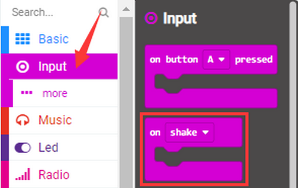

------

------

------

组合指令方块：

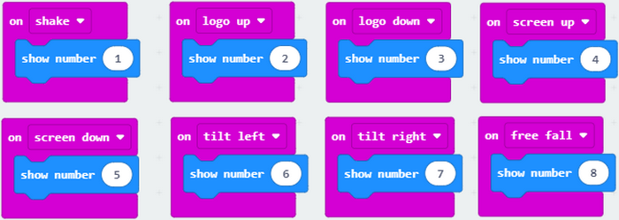

------

#### 5.实验现象1:
按照之前的方式将示例代码1下载到micro:bit主板，利用micro USB数据线上电，将micro:bit主板晃动，则可见LED点阵显示数字1（表明只要有晃动，无论朝哪个方向晃动，该条件都将满足）。    [How to download?  How to quick download?](#3.1.3Step 3: 下载代码：) 
当micro:bit主板的Logo朝上时，LED点阵显示数字2，Logo朝上示意图如下所示：

------

同理，micro:bit主板的Logo朝上时，LED点阵显示数字3(倒立的3)，Logo朝下示意图如下所示：

------

当屏幕朝上（指的是LED点阵朝上）时，LED点阵显示数字4。如下图所示：

------

同理，当屏幕朝下（指的是LED点阵朝下）时，LED点阵显示数字5。
当micro:bit主板向左倾斜（是指LED点阵先朝上，然后再往左边倾斜）时，LED点阵显示数字6。如下图所示：

------

同理，当micro:bit主板向右倾斜（是指LED点阵先朝上，然后再往右边倾斜）时，LED点阵显示数字7。如下图所示：

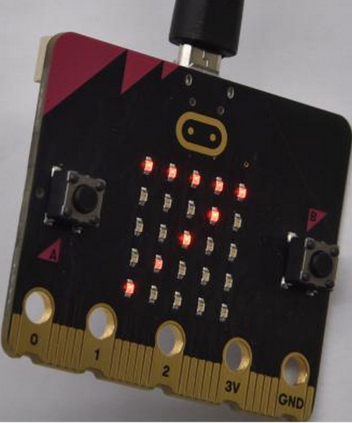

------

当不小心碰到micro:bit主板使其从桌面掉落，则为做自由落体运动，此时，micro:bit主板满足自由落体的条件，则LED点阵显示数字8。（注意：此方法操作时，很容易把micro:bit主板摔坏，不建议操作）
注意：（3g、6g、8g， 如果需要满足此条件，则需要达到3倍，6倍，8倍重力加速度甩动micro:bit主板。如果你们有兴趣的话，这部分代码可以自己添加）

#### 6.示例代码2：

寻找指令方块：

------

------

------

组合指令方块：

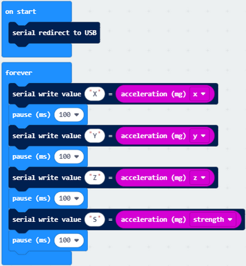

------

#### 7.实验现象2：
按照之前的方式将示例代码2下载到micro:bit主板，利用micro USB数据线上电，点击“显示控制台(设备)”按钮：  [How to download?  How to quick download?](#3.1.3Step 3: 下载代码：) 

首先，查阅MMA8653FC数据手册，以及micro:bit主板的硬件原理图得知，micro:bit主板的加速度计坐标如下图所示：

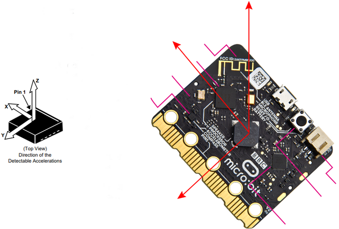

显示出如下界面：分别显示了加速度在X轴，Y轴，Z轴的分解值，以及加速度的合成(重力加速度及其它外力作用的加速度合成): 

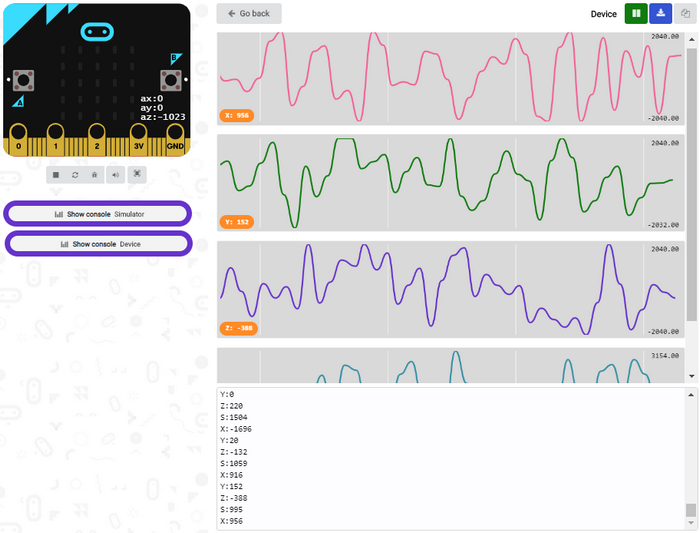

如果你的电脑系统是Windows7/8而不是Windows 10，则在Google Chrome中是无法进行设备配对，这里需要使用CoolTerm软件来读取串口数字的。
打开CoolTerm，点击Options，选择SerialPort，设置COM口和波特率，波特率设置为115200（经过测试，micro:bit主板的USB串口通讯波特率是115200），点击OK后，最后点击Connect。CoolTerm串口监视器分别显示了加速度在X轴、Y轴、Z轴的分解，以及加速度的合成(重力加速度及其它外力作用的加速度合成)，可得数据变化如下图：

### Project 8: 光照强度检测

#### 1.实验介绍:
本实验项目将介绍micro:bit主板对外界光照强度的检测，由于micro:bit主板并不自带光敏传感器，对外界光照强度的检测是通过micro:bit主板上的LED点阵屏进行的，LED点阵被用来感知周围的光，并反复地将LED转换成输入，并采样电压衰减时间，这样检测出来的光照强度是一个相对值。（注意：将光线亮度级别输出至串口，输出的是一个相对值。）

#### 2.所需组件:

| Micro:bit主板*1 |  |
| --------------- | ---------------------- |
| Micro USB 线*1  |  |

#### 3.实验接线:
通过micro USB线将micro:bit主板连接到你的电脑上。

#### 4.示例代码:

寻找指令方块：

------

------

------

------

组合指令方块：

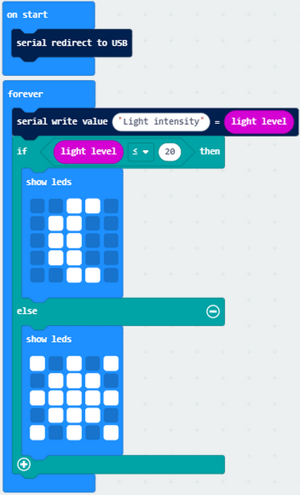

------

#### 5.实验现象:
按照之前的方式将示例代码下载到micro:bit主板，利用micro USB数据线上电，点击“显示控制台(设备)”按钮：   [How to download?  How to quick download?](#3.1.3Step 3: 下载代码：) 

显示串口输出数据，用手全部遮住micro:bit 主板的LED点阵，光线亮度级别约为0；然后将micro:bit主板的LED点阵放置于光照下，随着光照强度增强，亮度级别值也在逐渐增大。如下图所示：

代码中的20是一个随意设置的光照强度级别值，如果当前光照强度级别小于等于20，月亮就会出现在micro:bit主板的LED点阵上。如果大于20时，太阳就会出现。
如果你的电脑系统是Windows7/8而不是Windows 10，则在Google Chrome中是无法进行设备配对，这里需要使用CoolTerm软件来读取串口数字的。
打开CoolTerm，点击Options，选择SerialPort，设置COM口和波特率，波特率设置为115200（经过测试，micro:bit主板的USB串口通讯波特率是115200），点击OK后，最后点击Connect。这样，CoolTerm串口监视器显示光线亮度级别值。

### Project 9: 扬声器

#### 1.实验介绍：
micro:bit主板有内置扬声器，这使得在你的项目中添加声音变得非常容易。任何micro:bit主板都可以与扬声器一起工作创作声音项目，但有了新款的micro:bit主板，你也可以用一些新的声音来表达自己：让你的micro:bit主板的扬声器发出咯咯笑，问候你，或者让你知道它在打哈欠或悲伤等等。你也可以编写一首歌曲，你的micro:bit主板可以通过编程制作各种各样的声音——从单个音符、音调和节拍到你自己的音乐作品，例如：歌曲《欢乐颂》，让扬声器播放出来。
你也可以关闭micro:bit主板内置的扬声器，声音仍然会从引脚出来，所以你仍然可以享受连接在GND和P0的耳机播放出的优美音乐，在MakeCode中，则需要使用“关闭内置扬声器”的音乐块关闭micro:bit主板内置的扬声器。

#### 2.所需组件:

| Micro:bit主板*1 |  |
| --------------- | ---------------------- |
| Micro USB 线*1  |  |

#### 3.实验接线:
通过micro USB线将micro:bit主板连接到你的电脑上。

#### 4.示例代码:

寻找指令方块：

------

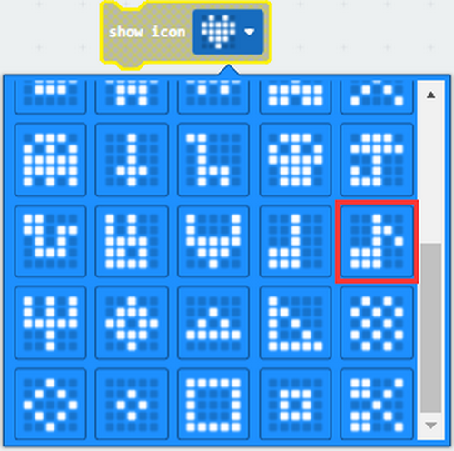

------

------

组合指令方块：

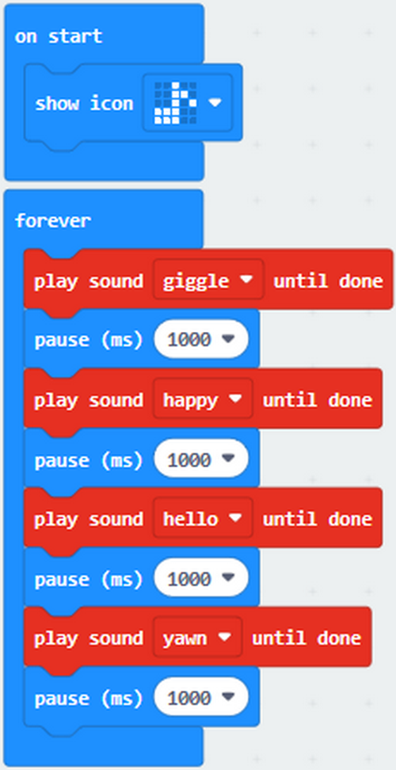

------

#### 5.实验现象1: 
按照之前的方式将示例代码1下载到micro:bit主板，利用micro USB数据线上电，micro:bit主板上的扬声器发出声音且LED点阵显示音乐标志图案。  [How to download?  How to quick download?](#3.1.3Step 3: 下载代码：) 

#### 6.示例代码2:

寻找指令方块：

------

------

------

组合指令方块：

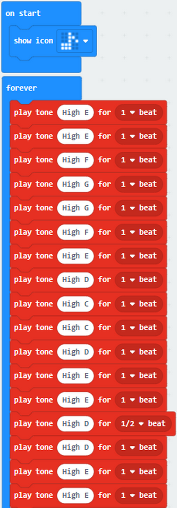

歌曲《欢乐颂》的简谱如下：

更多音乐简谱知识的相关链接：<https://en.wikipedia.org/wiki/Numbered_musical_notation>

### Project 10: 触摸感应logo

#### 1.实验介绍：
如果你有了新款的micro:bit主板，你可以在你的项目中使用金色的触摸感应logo作为另一个输入，这就像多了一个按钮。触摸感应采用的是电容式触摸传感器，当你手指按下（或触摸）它时，它就能感应到电场的微小变化----就像你的手机或平板电脑屏幕一样。当你像按按钮一样按下它时，你可以在程序中触发事件。

#### 2.所需组件:

| Micro:bit主板*1 |  |
| --------------- | ---------------------- |
| Micro USB 线*1  |  |

#### 3.实验接线:
通过micro USB线将micro:bit主板连接到你的电脑上。

#### 4.示例代码:

寻找指令方块：

------

------

------

------

------

------

组合指令方块：

------

5.实验现象:
按照之前的方式将示例代码下载到micro:bit主板，利用micro USB数据线上电，手指按住micro:bit主板上“Logo”标志处，micro:bit主板上的LED点阵显示“❤”图案；手指松开micro:bit主板上“Logo”标志处，会出现数字，手指按得时间越久在松开，出现的数字越大。   [How to download?  How to quick download?](#3.1.3Step 3: 下载代码：) 

### Project 11: 麦克风

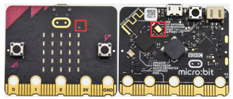

#### 1.实验介绍：
micro:bit主板有一个内置麦克风，它可以对嘈杂和安静的声音做出反应，也可以测量环境的嘈杂程度。你可以使用它作为一个简单的输入---当你鼓掌时，micro:bit主板上前面内置麦克风LED指示灯会被打开。它还可以测量声音的强度，所以你可以制作一个噪音等级表或与音乐合拍的迪斯科灯光。麦克风是在新款的micro:bit主板的背面，而在前面，你会发现一个内置麦克风LED指示灯，还有紧挨着让声音进入麦克风的孔。当你的micro:bit主板在测量声音级别时，它就会亮起来。

#### 2.所需组件:

| Micro:bit主板*1 |  |
| --------------- | ---------------------- |
| Micro USB 线*1  |  |

#### 3.实验接线:
通过micro USB线将micro:bit主板连接到你的电脑上。

#### 4.示例代码:

寻找指令方块：

------

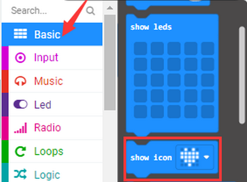

------

组合指令方块：

#### 5.实验现象1：
按照之前的方式将示例代码1下载到micro:bit主板，利用micro USB数据线上电，当你鼓掌时，micro:bit主板上的LED点阵显示“❤”图案；当外界环境安静时，micro:bit主板上的LED点阵显示“”图案。   [How to download?  How to quick download?](#3.1.3Step 3: 下载代码：) 

#### 6.示例代码2:

寻找指令方块：

------

------

------

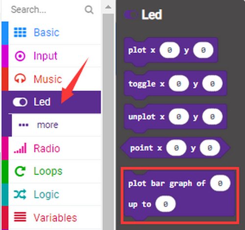

------

------

组合指令方块：

------

#### 7.实验现象2：
按照之前的方式将示例代码2下载到micro:bit主板，利用micro USB数据线上电，点击“显示控制台(设备)”按钮：   [How to download?  How to quick download?](#3.1.3Step 3: 下载代码：) 

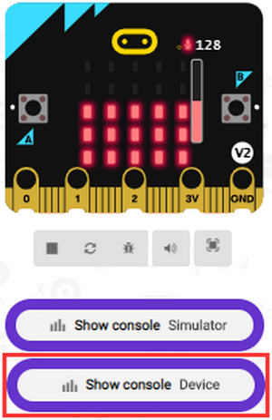

显示串口输出数据，当外界环境的声音增大时，串口输出的声音级别值也增大，如下图所示：

并且，当你按下micro:bit主板上的A键时，micro:bit主板上的LED点阵显示检测到的此时环境中最大声音级别值（这里需要注意：通过按micro:bit背面的重置按钮重置最大值。）；当鼓掌时，LED点阵显示声音级别大小图案。

### Project 12: 触摸Logo控制扬声器

#### 1.实验介绍:
前面的实验项目中已经学习过microbit板上的金色logo工作原理及控制方法和扬声器发生的原理。在本项目中，我们将金色logo和扬声器相结合，通过触摸金色logo，扬声器播放音乐。

#### 2.所需组件:

| Micro:bit主板*1 |  |
| --------------- | ---------------------- |
| Micro USB 线*1  |  |

#### 3.实验接线:
通过micro USB线将micro:bit主板连接到你的电脑上。

#### 4.示例代码:

寻找指令方块：

------

------

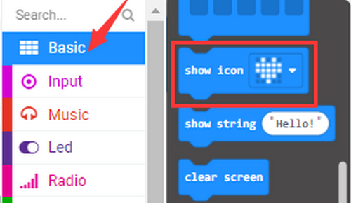

------

------

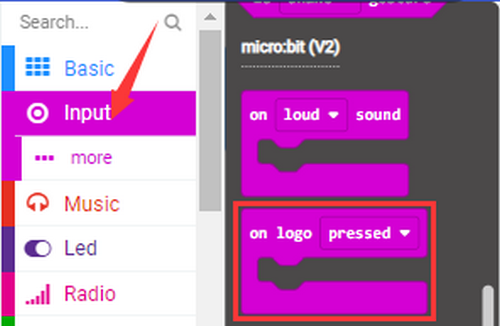

------

组合指令方块：

------

#### 5.实验现象：
按照之前的方式将示例代码下载到micro:bit主板，利用micro USB数据线上电，当手触摸金色Logo时，micro:bit主板上的扬声器一首“生日歌”。   [How to download?  How to quick download?](#3.1.3Step 3: 下载代码：) 

### Project 13: 躲子弹游戏

#### 1.实验介绍:
前面的实验项目中已经学习过micro:bit主板上按键的工作原理及控制方法，在本项目中，将继续学习按键的控制方法，按键A和B与LED点阵屏相结合，使用按键A和B设计躲子弹游戏。

#### 2.所需组件:

| Micro:bit主板*1 |  |
| --------------- | ---------------------- |
| Micro USB 线*1  |  |

#### 3.实验接线:
通过micro USB线将micro:bit主板连接到你的电脑上。

#### 4.示例代码:

寻找指令方块：

------

------

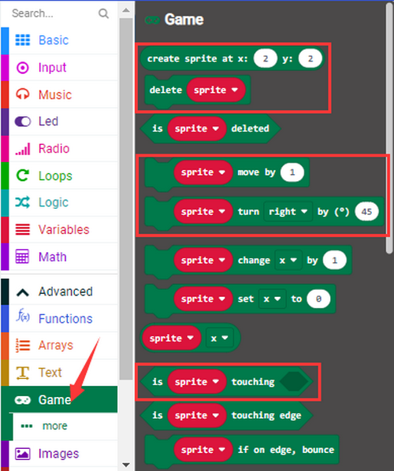

------

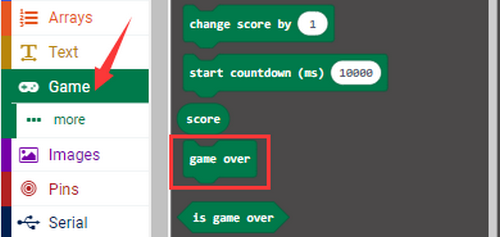

------

------

------

------

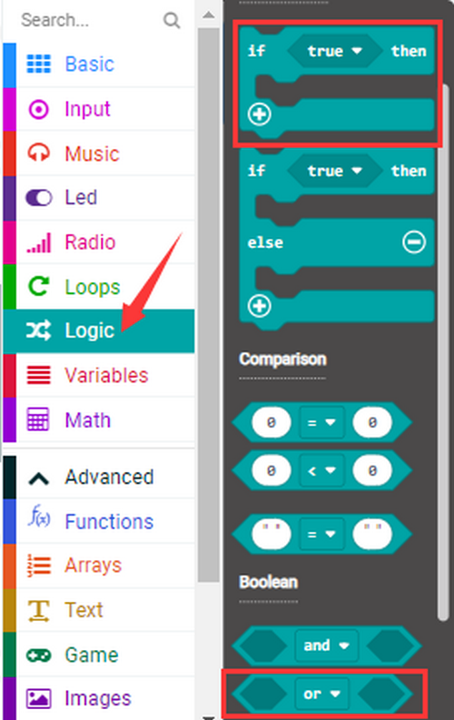

------

组合指令方块：

------

------

#### 6.实验现象1：
按照之前的方式将示例代码1下载到micro:bit主板，这样，游戏开始，子弹从上面掉下来，按键A和B控制角色G左右移动躲避子弹，如果角色G没有躲过子弹，游戏结束。   [How to download?  How to quick download?](#3.1.3Step 3: 下载代码：) 

#### 7.游戏玩法2：
在游戏玩法1中加入了得分，并且随着得分的增加，难度也会逐渐增加。当角色G每躲过一颗子弹，得分加1，当角色G遇到子弹时，游戏暂停，显示分数，再结束游戏。然后同时按下按键A和B，游戏又重新开始。

#### 8.示例代码2：

寻找指令方块：

------

------

------

------

------

------

------

------

------

------

组合指令方块：

------

------

------

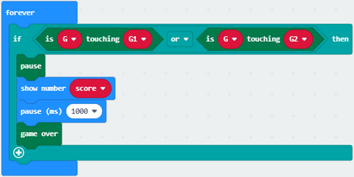

------

#### 9.实验现象2：
按照以前的方式将示例代码2下载到micro:bit主板，这样，游戏开始，子弹从上面掉下来，按键A和B控制角色G左右移动躲避子弹，当角色G每躲过一颗子弹，得分加1，当角色G遇到子弹时，游戏暂停，显示分数，再结束游戏。   [How to download?  How to quick download?](#3.1.3Step 3: 下载代码：) 

### Project 14: micro:bit的蓝牙无线通信

1.实验介绍：
micro:bit主板自带了nRF52833处理器（内置蓝牙5.1低功耗的BLE(Bluetooth Low Energy)设备）以及2.4GHz天线，可进行蓝牙无线通信和2.4GHz无线通信。使得micro:bit主板可以与各种蓝牙设备进行通信，包括智能手机和平板电脑。
在本实验中，主要讲解micro:bit主板实现蓝牙无线通信功能，我们可以通过连接蓝牙，实现无线传输代码（信号）功能。我们利用一个苹果系统设备（手机/iPad）和micro:bit主板连接，实现无线传输功能。设置安卓系统手机实现无线传输方法和苹果系统设备（手机/iPad）类似，这里就不一一介绍了。

#### 2.所需组件:

| Micro:bit主板*1 |    |
| --------------- | ------------------------ |
| Micro USB 线*1  |    |
| 智能手机/IPad*1 |  |

#### 3.实验接线:
通过micro USB线将micro:bit主板连接到你的电脑上。

#### 4.实验步骤：
1. 如果你的智能手机/iPad是苹果系统的，需要先在电脑上进入网页<https://www.microbit.org/get-started/user-guide/ble-ios/> ，点击“Download pairing HEX file”下载micro:bit的固件到创建的文件夹中或电脑桌面上，并将下载好的micro:bit固件烧入micro:bit主板中。（这一步只针对于苹果系统的智能手机/iPad，安卓系统智能手机/不需要这一步）

------

------

------

2. 在苹果系统设备（手机/iPad）上打开App Store，在App Store的搜索框中输入“micro bit”，然后选中micro:bit 选项，会出现下载界面（如下图所示：），点击“”，就可以下载安装对应的APP。

3. 苹果系统设备（手机/iPad）和micro:bit主板配对连接。
  - 打开苹果系统设备（手机/iPad）上的蓝牙。

  - APP安装成功后，点击打开APP，先确定micro USB数据线已经将micro:bit主板和电脑连接上，再点击APP的第一项“Choose micro:bit”，开始配对蓝牙。
    
    
    
  - 点击配对一个新的micro:bit，开始配对。
    
    
    
  - 根据提示，首先同时按住micro:bit主板上的按键A和B，然后按下micro:bit主板后面的复位&电源按钮几秒钟（按键A和B不能松开），再松开复位&电源按钮，micro:bit主板上LED点阵会显示一个密码图案。最后松开micro：bit主板上的按键A和B，接着点击“下一步”。

  

  

  - 在苹果系统手机/iPad上设置密码图案，使图案和micro:bit主板上显示的密码图案一样，点击“下一步”。

  

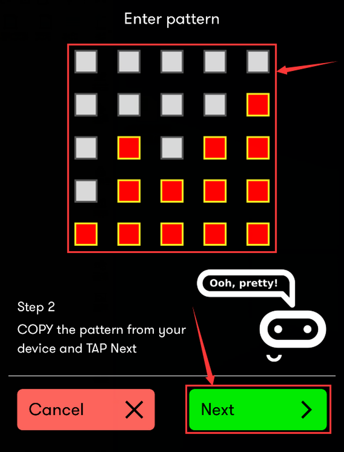

  - 点击“下一步”，出现对话框，在对话框中点击“Pair”。几秒钟后，配对成功，同时micro:bit主板上的LED点阵显示“√”图案。

    

    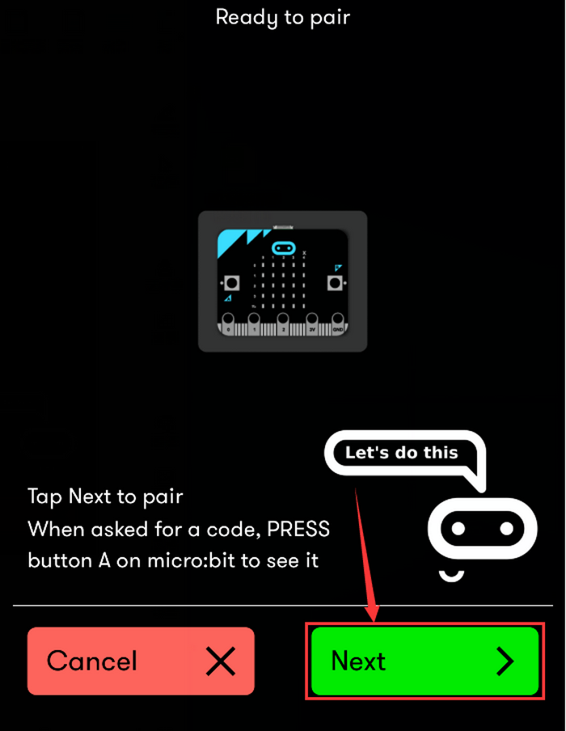

    

    

    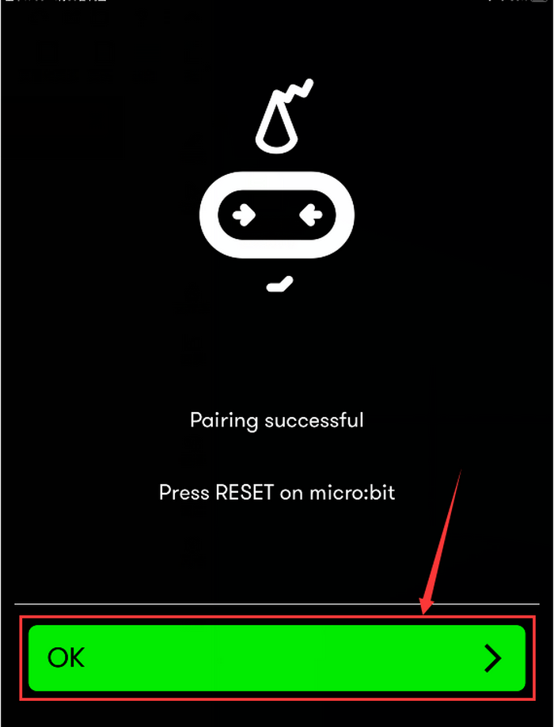

  -  蓝牙配对成功后，开始利用APP编写代码，并上传代码。

     1. 点击第二项“Create Code”，进入编程界面，开始编写代码程序。（点击，出现对话框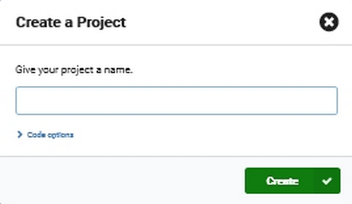，在对话框中直接点击“Create √”后就进入编程界面)
     
        
     
        
     
        
     
        
     
     2. 将代码程序项目名称设置为“1”，点击保存图案“”，保存代码程序。
     
         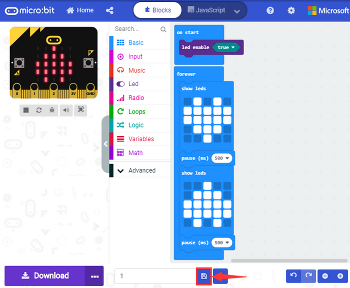
     
     3. 项目代码程序保存成功后，点击第三项“Flash”进入上传代码程序界面。默认选择代码程序是刚刚保存的项目名称为“1”的代码程序，然后点击“Flash”上传代码程序“1”.
     
        
     
        
     
        
     
     4. 几秒钟后，代码程序“1”上传成功，会显示如下图。然后micro:bit主板上的LED点阵显示跳跃的“心”对应图案。
     
        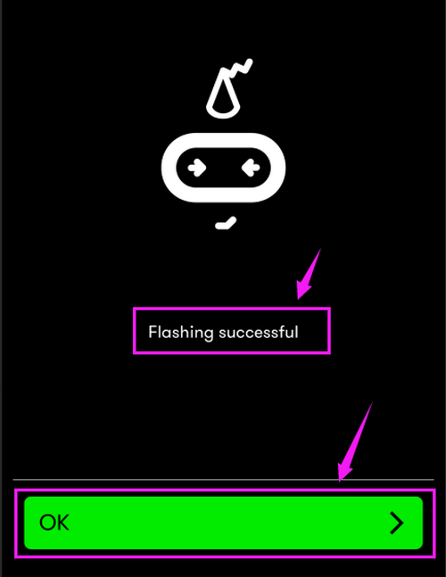

------

## 5.故障排除

### 5.1关于Microbit无法下载程序

关于Microbit无法下载程序，盘符显示MAINTENANCE的解决方法

**问题现象：**
很多新用户最近遇到，刚买到的Micro:bit插上Micro USB线连接到电脑上，点击下载，下载不进去，Micro:bit没有反应。
如果用户的软件操作没有问题的话，可能是自己不小心按着Micro:bit上的复位键进入了Micro:bit刷固件模式或者可能是自己的一些误操作导致Micro:bit丢失了固件。
所谓的刷固件模式：插上Micro:bit，显示多了一个盘符“MAINTENANCE”，进入了刷固件模式后，是无法进行正常的程序下载的。

**解决办法：**
1. 从此页面将十六进制文件下载到您的电脑。 
    下载最新的micro:bit固件-0255的链接：https://www.microbit.org/get-started/user-guide/firmware/ 
    （注意：你可以点击上述链接下载最新固件-0255十六进制文件；如果你不下载，在相应的文件夹中也有我们事前下载好的最新固件-0255十六进制文件）
2. 按照下图操作，直接将下载好的最新固件-0255十六进制文件拖到“MAINTENANCE”，即可将Micro:bit恢复到正常模式。

**如何避免进入“MAINTENANCE”：**

1. Micro:bit插入Micro USB线时，不要按着Micro:bit上的复位键，再插Micro USB线，
      很多新手不小心就按着Micro:bit上的复位键插上Micro USB线就进入了刷固件模式（新手常犯的错误）

      
      
2. 在micro:bit程序下载过程中，不要突然拔掉，这可能导致固件丢失，micro:bit就会进入刷固件模式了
3. 在实验过程中，接线接错，导致短路，也有可能导致micro:bit固件丢失，新手操作一定要注意。

------

### 5.2使用 WebUSB 进行下载的故障排除

Micro：bit与WebUSB（/ device / usb / webusb）配对时遇到问题？让我们尝试找出原因。

#### 6.2.1Step 1: 检查你的线

确保使用micro USB线将micro：bit连接到电脑。 连接后，您应该会在Windows资源管理器中看到一个**MICROBIT** 驱动器。 

如果可以看到MICROBIT驱动器，请转到步骤2。如果看不到该驱动器，请执行以下操作：

- 确保micro USB线正常工作。micro USB线是否在另一台电脑上工作？如果不是，请查找其他micro USB线。 某些micro USB线可能仅提供电源连接，实际上并未传输数据。 在

- 电脑上尝试另一个USB端口。 电缆是否正常，但是您仍然看不到MICROBIT 驱动器？ 嗯，您的micro：bit可能有问题。尝试在microbit.org上的故障查找页面中（<https://support.microbit.org/support/solutions/articles/19000024000-fault-finding-with-a-micro-bit>）描述的其他步骤。如果这样做没有帮助，您可以创建支持通知单（<https://support.microbit.org/support/tickets/new>）将问题通知Micro：bit基金会。 跳过其余步骤。

------

#### 5.2.2Step 2: 检查您的固件版本

micro：bit上的固件版本可能需要更新。 让我们检查： 

1. 找到MICROBIT 驱动 
2. 打开DETAILS.TXT 文件

在文件中查找说明版本号的行。 Version: ...

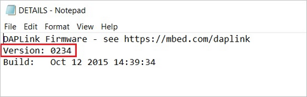

或接口Version: ... 

如果版本为0234、0241、0243，则需要更新固件（/设备/固件）在您的micro：bit 
上。 转到步骤3，然后按照升级说明进行操作。 
如果版本是0249、0250或更高版本，则您具有正确的固件，请转到步骤4。

------

#### 5.2.3Step 3: 升级固件

1. 将您的micro：bit进入维护模式。 为此，请从micro：bit拔下micro USB线， 
然后在按住复位按钮的同时重新连接micro USB线。 插入micro USB线后，可以释放复位按钮。 现在，您应该像以前一样看到一个MAINTENANCE驱动器，而不是MICROBIT驱动器。 同样，黄色的LED指示灯将在重置按钮旁边保持点亮。

2. 下载 firmware .hex file 
    (<https://microbit.org/guide/firmware/>)
3. 将该文件拖放到 MAINTENANCE驱动器上。
4. 复制HEX文件时，黄色LED指示灯将闪烁。 复制完成后，LED会熄灭，并且 
    micro：bit会重置。 现在，MAINTENANCE驱动器会变回MICROBIT。 
5. 升级完成！ 您可以打开DETAILS.TXT 文件进行检查并查看固件版本已更改为与您复制的HEX文件的版本相匹配。
    如果您想了解有关连接板，维护模式和升级固件的更多信息，请在固件指南请在固件指南（<https://microbit.org/guide/firmware/>）中进行阅读。

------

#### 5.2.4Step 4: 检查您的浏览器版本

WebUSB是一项相当新的功能，可能需要您更新浏览器。 检查您的浏览器版本是否 
符合以下条件之一： 适用于Android，Chrome操作系统，Linux，macOS和Windows 10的Chrome 65+。 

------

#### 5.2.5Step 5: 配对装置

更新固件后，打开Chrome浏览器，转到编辑器，然后点击齿轮菜单中的“配对设备”。 有关配对说明，请参见WebUSB（/ device / usb / webusb），对应的链接：<https://microbit.org/get-started/user-guide/web-usb/> 。 
享受快速下载！ 