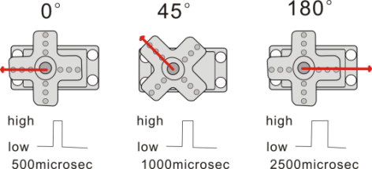
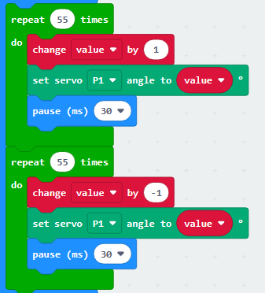
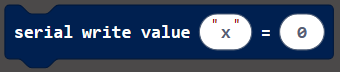
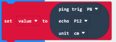
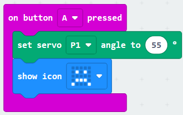
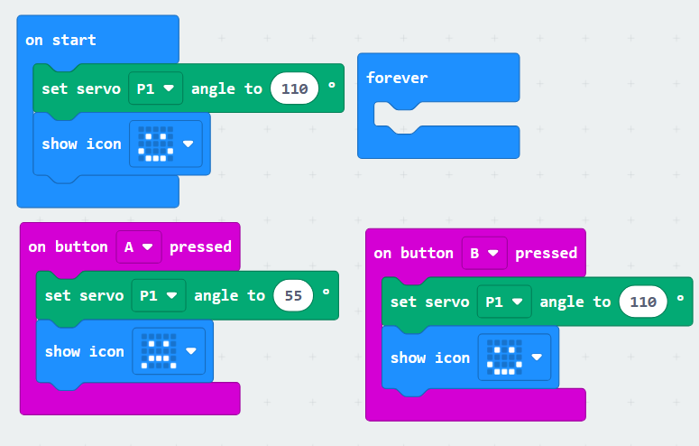
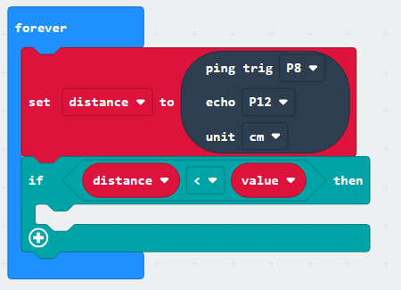

# 鳄鱼咬手

## 1.舵机模块

### 1.1 简介

舵机是一种位置伺服的驱动器，主要是由外壳、电路板、无核心马达、齿轮与位置检测器所构成。其工作原理是由接收机或者单片机发出信号给舵机，其内部有一个基准电路，产生周期为20ms，宽度为1.5ms 的基准信号，将获得的直流偏置电压与电位器的电压比较，获得电压差输出。

舵机有很多规格，但所有的舵机都有外接三根线，分别用棕、红、橙三种颜色进行区分，由于舵机品牌不同，颜色也会有所差异，棕色为接地线，红色为电源正极线，橙色为信号线。

舵机的转动的角度是通过调节PWM（脉冲宽度调制）信号的占空比来实现的，标准PWM（脉冲宽度调制）信号的周期固定为20ms（50Hz），理论上脉宽分布应在1ms到2ms 之间，但是，事实上脉宽可由0.5ms 到2.5ms 之间，脉宽和舵机的转角0°～180°相对应。

### 1.2 模块参数

工作电压：DC 3.3V〜5V

可操作角度范围：大约 180°(在 500→2500 μsec)

脉波宽度范围：500→2500 μsec

空载转速：0.12±0.01 sec/60（DC 4.8V）  0.1±0.01 sec/60（DC 6V）

空载电流：200±20mA（DC 4.8V）  220±20mA（DC 6V）

停止扭力：1.3±0.01kg·cm（DC 4.8V）  1.5±0.1kg·cm（DC 6V）

停止电流：≦850mA（DC 4.8V）  ≦1000mA（DC 6V）

待机电流：3±1mA（DC 4.8V）  4±1mA（DC 6V）

### 1.3 接线图

|  扩展板   |   舵机    |
| :-------: | :-------: |
|    GND    | G（棕色） |
|    3V3    | V（红色） |
| P1 / io14 | S（黄色） |

### 1.4 代码

注意：舵机的旋转角度是0-180度，但是如果已经将鳄鱼组装好了那么角度必须在55-130度之间旋转，因为如果控制舵机到180度但是舵机因为鳄鱼的结构卡住了达不到180度舵机就会发烫导致烧坏，同理0度或者其他能导致舵机卡住发烫的也一样会烧坏舵机！

**代码文件：**

代码文件下载链接：[点击下载代码文件](.\MakeCode\MicrobitBitingCrocodile.zip)

下载代码文件后解压，然后双击`microbit-1-Servo_Code1.hex`打开文件进行上传代码

**自己动手添加代码：**

1.添加舵机驱动库，点击

2.在搜索框中输入“Servo”，然后点击搜索，就能看到名为Servo的库文件了，点击添加即可

3.添加成功

4.在栏中拖出到中，并设置引脚为P1，角度为55度

5.在栏拖出到下面，并设置延时为1000ms

6.重复步骤4和步骤5，添加设置舵机为90度延时1000ms与设置舵机110度延时1000ms的代码块

**完整代码：**

### 1.5 代码结果

上传代码后鳄鱼会先张开嘴一秒钟，然后闭一半的嘴一秒钟，然后再完全将嘴巴闭合。一直重复这个动作。

### 1.6 扩展教程

前面我们控制的是鳄鱼进行大角度的张嘴闭嘴，那我们该如何控制鳄鱼慢慢的闭嘴和慢慢的张嘴呢！

#### 1.6.1 代码

**代码文件：**

代码文件下载链接：[点击下载代码文件](.\MakeCode\MicrobitBitingCrocodile.zip)

下载代码文件后解压，然后双击`microbit-1-Servo_Code2.hex`打开文件进行上传代码

**自己动手添加代码：**

1.在栏点击，添加一个名为value的变量

2.将栏的拖到中，并在白色框中设置值为55

3.在栏中拖出到中，并在白色框中设置循环次数为55

4.在栏中拖出到中

5.在栏中拖出到下面，并设置引脚为P1

6.在栏中拖出放到的白色框中

7.在栏拖出到下面，并设置延时为30ms

9.右击然后点击“Duplicate”

10.将复制好的代码块添加在下方，修改白色框中的“1”为“-1”

**完整代码：**

#### 1.6.2 代码结果

上传代码后，鳄鱼会慢慢张嘴然后会慢慢闭合，一直重复增动作

## 2.超声波模块

### 2.1 简介

HC-SR04超声波传感器像蝙蝠一样使用声纳来确定与物体的距离。它在一个易于使用的包装中提供了出色的非接触式范围检测，具有高精度和稳定的读数。它配有超声波发射器和接收器模块。 HC-SR04或超声波传感器正在广泛的电子项目中用于创建障碍物检测和距离测量应用以及各种其他应用。

### 2.2 模块参数

工作电压 :3.3-5V 

静态电流 : <2mA

工作电流: 15mA

有效角度: <15°

距离范围 : 2cm – 400 cm

精度 : 0.3 cm

测量角度:30度

触发输入脉冲宽度:10微秒

### 2.3 接线图

|   扩展板   | 模块 |
| :--------: | :--: |
|    GND     |  G   |
|    3V3     |  V   |
|  P8 / io4  | Trig |
| P12 / io15 | Echo |

### 2.4 代码

注意：超声波的测量距离是2-300cm，但是装在鳄鱼上后只能识别4-30cm，这是因为超声波是有接收反弹回来的信号是有一定角度的，但是由于鳄鱼身体的椴木板挡住了导致只能识别到30cm，不过这不影响我们的咬手鳄鱼教程

**代码文件：**

代码文件下载链接：[点击下载代码文件](.\MakeCode\MicrobitBitingCrocodile.zip)

下载代码文件后解压，然后双击`microbit-2-Ultrasonic_Code.hex`打开文件进行上传代码

**自己动手添加代码：**

1.添加舵机驱动库，点击

2.在搜索框中输入“sonar”，然后点击搜索，就能看到名为sonar的库文件了，点击添加即可

3.添加成功

4.在栏，拖出到中

5.在栏点击，添加一个名为value的变量

6.在栏拖出到中

7.在栏拖出到的白色框中，并设置Trig为P8脚,echo 为P12脚，unit为CM

8.在栏拖出放到下面，并修改第一个白色框中的字符为“distance=”

9.在栏退出放到的第二个白色框中

10.在栏拖出放到下面，并修改延时为500ms

**完整代码：**

### 2.5 代码结果

如果你不能在浏览器的makecode编译界面打印数据就使用CoolTerm软件，详情在micro bit基础教程中。

上传代码后，打开CoolTerm软件，点击Options，选择SerialPort，设置COM口和波特率，波特率设置为115200（经过测试，micro:bit  主板的USB串口通讯波特率是115200），点击OK后，最后点击Connect。

设置完成后我们便能在串口打印区看到超声波感应到的距离了，串口打印距离会每个0.5s打印一次

## 3.按键控制鳄鱼咬合

### 3.1 简介

通过ESP32 Easy Coding Board板载的AB按键控制鳄鱼张嘴与闭嘴。

### 3.2 代码

**代码文件：**

代码文件下载链接：[点击下载代码文件](.\MakeCode\MicrobitBitingCrocodile.zip)

下载代码文件后解压，然后双击`microbit-3-Key_controlled_crocodile_Code .hex`打开文件进行上传代码

**自己动手添加代码：**

1.添加servo库，然后在栏拖出放到中，并设置引脚为P1，角度为110度

2.在栏拖出到中，并设置点阵显示

3.在栏拖出然后在里面添加设置舵机为55度的代码和点阵显示的代码

4.右击复制，然后修改按键为B，舵机角度为110度，点阵显示

**完整代码：**

### 3.3 代码结果

上传代码成功后，按下板载的按键A鳄鱼点阵显示并且鳄鱼嘴巴闭合 ，按下板载的按键B鳄鱼点阵显示并且鳄鱼嘴巴张开。

## 4.鳄鱼咬手

### 4.1 简介

咬手鳄鱼，鳄鱼张开嘴巴当你把手伸进鳄鱼嘴巴的时候鳄鱼上面的超声波会测量手到鳄鱼嘴巴里的深度，当达到我们设置好的深度的时候鳄鱼就会咬下。

### 4.2 代码

**代码文件：**

代码文件下载链接：[点击下载代码文件](.\MakeCode\MicrobitBitingCrocodile.zip)

下载代码文件后解压，然后双击`microbit-4-Crocodile_Bite_Code.hex`打开文件进行上传代码

**自己动手添加代码：**

1.添加舵机库与超声波库，在生成两个变量一个变量叫“distance”另一个变量叫“value”

2.将变量的值设置成5的代码块与将设置舵机旋转到110度代码块与点阵显示的代码块，添加到中

2.将添加到中，设置变量为‘distance’

3.将添加到中，设置trig为P8脚，echo为P12脚，unit为CM

4.在栏拖出代码块然后添加到下面

5.在拖出代码块，添加到代码块的菱形框中

6.将添加在的左边，添加在右边形成条件式；distance < value

7.将添加到中

8.在栏拖出代码块到中，并设置数值为3to8

9.在中添加代码，先控制舵机旋转到55度，点阵显示，然后延时3秒钟，舵机旋转到110度，点阵视显示然后延时1秒钟

**完整代码：**

### 4.3代码结果

上传代码成功后鳄鱼张嘴，点阵显示绿色微笑，手往鳄鱼嘴里申当手离超声波的距离满足鳄鱼咬合条件时，鳄鱼咬合点阵显示红色哭脸，咬合3秒钟后鳄鱼松嘴并且点阵显示绿色笑脸，最后的1秒延时是为了可以将手从鳄鱼嘴里缩回来准备的。1s过后进入下一个咬手过程。

