# BBC Micro:bit Basic Tutorial

## 1.What is Micro:bit?

Micro:bit is an open source hardware platform based on the ARM architecture, which is launched by British Broadcasting Corporation (BBC) together with ARM, Barclays, element14 and Microsoft. The  core device is a 32-bit Arm Cortex-M4 with FPU micro-processing.

Though it is just the size of a credit card, the Micro:bit main board is equipped with loads of components, including a 5*5 LED dot matrix, 2  programmable buttons, an accelerometer, a compass, a thermometer, a  touch-sensitive logo, a MEMS microphone, a Bluetooth module of low  energy, as well as a buzzer. Thus, multiple sounds can be played without external devices. In addition, the Micro:bit board supports sleep mode. Users can long press the reset & power button on the back of the Micro:bit board to enter sleep mode and reduce battery power consumption.

Micro:bit development board is powerful, which is easy to use and expand. The gold finger of the bottom gear design can interact with various electronic components by fixing the alligator clips. Moreover, this board is capable of reading the data of sensors, controlling servos and RGB lights, and it can be attached with a shield to connect various sensors. It also supports a variety of programming platforms and is compatible with almost all PCs and mobile devices without installing the driver. It is of high integration of electronic modules with serial monitoring function for easy debugging.

Micro:bit has a wide range of applications. It can be used to program electronic games, sound and light interaction, robot control, scientific experiments and wearable device development. It can realize any cool little invention, whether it is a robot or a musical instrument. 

------

### 1.1Micro:bit V2 Mainboard Layout：

------

### 1.2Micro:bit V2 Pin-out：

Micro:bit pin functions：

|        Function        |                             Pin                              |
| :--------------------: | :----------------------------------------------------------: |
|          GPIO          | P0，P1，P2，P3，P4，P5，P6，P7，P8，P9，P10，P11，P12，P13，P14，P15，P16，P19，P20 |
|        ADC/DAC         |                   P0，P1，P2，P3，P4，P10                    |
|          IIC           |                    P19（SCL），P20（SDA）                    |
|          SPI           |             P13（SCK），P14（MISO），P15（MOSI）             |
|  PWM（commonly used）  |                   P0，P1，P2，P3，P4，P10                    |
| PWM（uncommonly used） |  P5、P6、P7、P8、P9、P11、P12、P13、P14、P15、P16、P19、P20  |
|        Occupied        | P3(LED Col3)，P4(LED Col1)，P5(Button A)，P6(LED Col4)，P7(LED Col2)，P10(LED Col5)，P11(Button B) |

 Visit the official website for more details：[Microbit hardware](https://tech.microbit.org/hardware/edgeconnector/)

https://microbit.org/guide/hardware/pins/

------

### 1.3 Notes for the Application of Micro:bit：

- It is recommended to cover it with a silicone protector to prevent short circuit for it has a lot of sophisticated electronic components.
- Its IO port is very weak in driving since it can merely handle current less than 300mA. Therefore, do not connect it with devices operating in large current, such as servo MG995 and DC motor or it will get burnt. Furthermore, you must figure out the current requirements of the devices before you use them and it is generally recommended to use the board together with a Micro:bit shield.
- It is recommended to power the main board via the USB interface or via the battery of 3V. The IO port of this board is 3V, so it does not support sensors of 5V. If you need to connect sensors of 5 V, a  Micro: Bit expansion board is required.
- When using pins(P3, P4, P6, P7 and P10)shared with the LED dot  matrix, blocking them from the matrix or the LEDs may display randomly.
- Pin 19 and 20 can not be used as IO ports though the Makecode shows they can. They can only be used as I2C communication.
- The battery port of 3V cannot be connected with battery more than 3.3V or the main board will be damaged.
- Forbid to operate it on metal products to avoid short circuit.

To put it simple, Micro:bit V2 main board is like a microcomputer,  which has made programming at our fingertips and enhanced digital innovation. And as for programming environment, BBC provides a website: https://microbit.org/code/, which has an easy-to-use graphical program MakeCode.

------

## 2.Micro:bit Driver Installation

**The micro:bit can be installed without a USB driver. However, if your computer fails to recognize the main board, you need to install the diver.**

**Driver installation：**

**（Please download tutorials in network disk.）**

Connect micro:bit mainboard to computer via USB cable.

Click the driver fileand tap Install.

------

------

Click Install.

------

Click “Install” and “Finish”.

------

------

Click “Computer”  —> “Properties” —> “Device manager”.

------

## 3. Code and Programming

The following instructions are applied for Windows system but it can also serve as a reference if you are using a different system.

### 3.1 Procedures

This chapter describes how to write program and load the program to the  Micro: Bit mainboard. Visit official website for more details：<https://microbit.org/guide/quick/>

#### 3.1.1 Step 1: Connect the Micro:bit

Connect the board to computer via USB cable.

For how to program via mobile deveices：<https://microbit.org/get-started/user-guide/mobile/>）

Multiple operation systems are compatible with this board, including Macs, PCs, Chromebooks and Linux (Raspberry Pi).

------

If the red LED on the back of the board is on, then the board is powered. When your computer communicates with the main board via the USB cable, the yellow LED on it will flashes. For example, it will flash when you burn a “hex”file.

Then Micro: bit main board will display a driver named “MICROBIT(E:)” on your computer. Please note that it is not an ordinary USB disk as shown below.

------

#### 3.1.2 Step 2: Write Programs：

Online version of Makecode：<https://makecode.microbit.org/>.

Click **New Project**. The dialog box **Create a Project** appears, fill it with **heartbeat** and click **Create √** .

If you are Windows 10 system, it is also viable to edit on the APP MakeCode for micro:bit , which is exactly like editing in the website.

Windows 10 App download：[https://www.microsoft.com/](https://www.microsoft.com/zh-cn/p/makecode-for-micro-bit/9pjc7sv48lcx?ocid=badgep&rtc=1&activetab=pivot:overviewtab)
Here we demonstrate on Google Chrome.

------

Write a micro:bit code.

You can drag some **Blocks** to the editing area and then run your program in Simulator as shown below: we demonstrate on how to edit **heartbeat** program.

------

Click “ JS JavaScript” to check JavaScript language.

------

Click the arrow to switch to “Python” language.

------

#### 3.1.3 Step 3: Download code：

If your computer is Windows 10 , just tap download and the program will be downloaded to your Micro: bit board.

If you are writing program through the website, following these steps:

1. Click the ‘Download’ in the editor to download a “hex” file, which can be read by the micro:bit board;
2. Copy the “hex” file to your board. For Windows, you can also click and select ‘Send to → MICROBIT(E:) ‘to copy the hex file to the Micro: bit board.

------

Or you may directly drag the “hex” file in **MICROBIT**.

During the process of copying the hex file to the Micro: bit, the yellow LED on the back of the board flashes. When the duplication is completed, the LED will stop flashing and remain on.

#### 3.1.4 Step 4: Run Program：

After the program is uploaded to the Micro: bit, you can power it via USB cable or an external power. Then the 5 x 5 LED dot matrix displays a heartbeat pattern.

Power via USB:

------

Power via external 3V：

**Caution:**

- When you program, the driver of Micro: bit will automatically eject and return so the hex files will disappear.
- The micro:bit board can only receive hexadecimal (hex) files and will not store any other files.

------

#### 3.1.5 Step5: Other Programming Languages：

This chapter has described how to use the Micro:bit main board.

Except for the Makecode graphical programming, if you want to write Micro:bit programs in other languages, visit https://microbit.org/code/ to learn more, or visit https://microbit.org/projects/ to find something you like.

### 3.2Makecode

Google Chrome online version：<https://makecode.microbit.org/>，or open the Windows 10 makecode App.

------

Click “New Project” and enter “heartbeat” to edit the code. Here is the main interface of Makecode.

There are blocks “on start” and “forever” in the code editing area.

When the power is plugged or reset, “on start” means that the code in the block only executes once, while “forever” implies that the code runs cyclically.

------

### 3.3 Quick Download

As mentioned before, if your computer is Windows 10 and you have downloaded the MakeCode APP. you can quickly download codes to the Micro: Bit main board by selecting ‘Download’.

While it is a little more trickier if you are using a browser to enter Makecode. However, if you use Google Chrome for Android, ChromeOS, Linux, macOS and Windows 10, the process can be easier.

We use the webUSB of Chrome to access the hardware device.

You could refer to the following steps to connect and pair devices.

**Devices Pairing：**

Connect the board to computer via USB cable.

------

Click “…” and “Connect device”.

------

Click “Next”.

------

Click “Next”.

------

Then select the corresponding device and click “Connect”. If no device shows up for selection, please refer to: https://makecode.microbit.org/device/usb/webusb/troubleshoot

If the links are too troublesome, refer to **Troubleshooting** in tutorial.

For how to update micro:bit firmware: https://microbit.org/guide/firmware/

------

Click “Done”.

------

**Download Program：**

After connection, clickand it will change into.

------

### 3.4 Makecode Extension Library

#### 3.4.1 Add library

Please follow the steps to add extension files:

Open makecode to enter a certain project, click the gear-shaped icon(settings) in the upper right corner to choose “Extensions”.

Or click Advanced to add Extensions.

------

You can choose to select the extension library through search or URL.

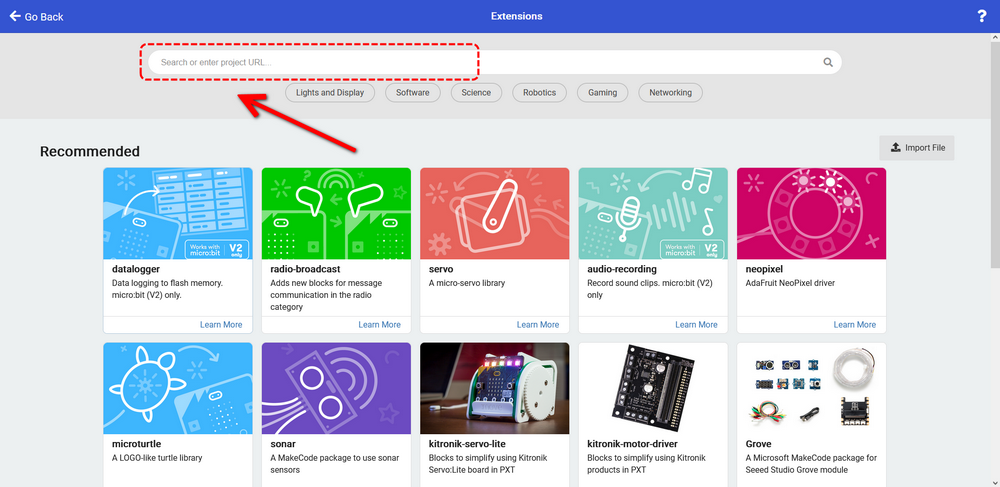

------

For instance, if you want to control a servo, you can search “servo” to add one.

------

Back to the interface and you can see a **Servos** library.

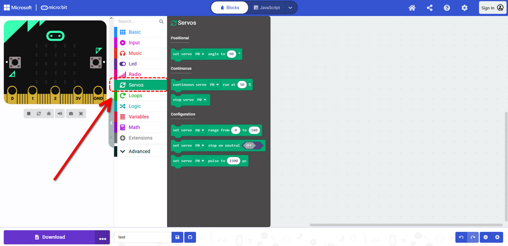

------

#### 3.4.2 Update/Delete library

Click **Js JavaScript** to switch to text code.

------

Click Explorer.

------

Find the extension library file in the extension list. Click the trash icon to delete the Servos extension library file.

------

Click **Remove it**.

------

Click **Blocks** to return to graphical programming.

------

------

### 3.5 Resources and Test Code

Download link：https://fs.keyestudio.com/KS0801

#### 3.5.1 Import Code

We provide hexadecimal code files (project files) for each project.  The file contains all the contents of the project and can be imported directly, or you can manually build the code blocks.

**For simple projects, dragging a block of code to complete the program is recommended.**

**For complex ones, it is recommended to conduct the program by loading the hex code files.**

Let’s take the “Heatbeat” project as an example to show how to load the code. Open the Web version of Makecode or the Windows 10 App  Makecode, and click “Import”.

------

Click “Import File…”.

------

Choose “Heart beat.hex”

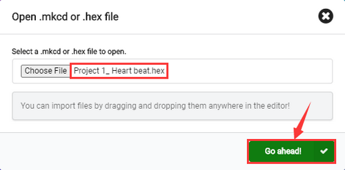

------

In addition to the above method, you can also drag the the test code into the code editing area, as shown below:

------

Wait for loading.

If your computer is Win7/8, the pairing cannot be done via Google Chrome. Therefore, digital signal or analog signal of sensors and modules cannot be shown on the serial simulator. So CoolTerm software is a nice choice to read the serial data.

#### 3.5.2 Install CoolTerm

CoolTerm download：<https://freeware.the-meiers.org/>

1. We take PC Windows as an example to download and unzip CoolTerm Win, and Mac/Linux can take it as a referance.
    
    
    ------
    
    
    
2. Tap it. Make sure the driver is connect to computer.

    

    ------

    

3. The functions of each button on the Toolbar are listed below: 

    

|          Icon           |                     Function                     |
| :---------------------: | :----------------------------------------------: |
|  |             Opens up a new Terminal              |
| 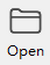 |             Opens a saved Connection             |
|  |       Saves the current Connection to disk       |
|  |           Opens the Serial Connection            |
| 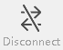 |           Closes the Serial Connection           |
|  |             Clears the Received Data             |
|  |       Opens the Connection Options Dialog        |
| 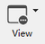 | Displays the Terminal Data in Hexadecimal Format |
|  |             Displays the Help Window             |

  

------

## 4.Micro:bit Basic Projects

### 4.1 Project 1: Heartbeat

#### 1.Introduction:
This project is easy to conduct with a micro:bit main board, a Micro USB cable and a computer. The micro:bit LED dot matrix will display a beating heart. It serves as a start for your entry to the programming  world!

#### 2.Components:

| Micro:bit Mainboard*1 |  |
| --------------------- | ---------------------- |
| Micro USB Cable*1     | 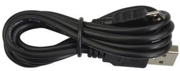 |

#### 3.Connection:
Connect the board to your computer via micro USB cable.

#### 4.Test Code:
（Please check code in Project 1 file.）

Visit https://makecode.micro:bit.org/reference to find more information about micro: bit blocks.

Visit https://makecode.micro:bit.org/ to edit your project code.

**Find code blocks:**

**Build blocks：**

Click “JSJavaScript” to see Java code:

Pull down to click “Python” to see Python code:

------

#### 5.Test Result:

After uploading test code to micro:bit main board and power on via the micro USB, the LED dot matrix shows patterns “❤” and “”.

   [How to download?  How to quick download?](#3.1.3Step 3: 下载代码：)

**If the downloading is not smooth, please remove the USB cable from the main board and then reconnect them and reopen Makecode to try  again.**

### Project 2: Single LED Blinking

#### 1.Introduction:
In this project, we intend to control a certain LED of the micro:bit main board and light it up.

#### 2.Components:

| Micro:bit Mainboard*1 |  |
| --------------------- | ---------------------- |
| Micro USB Cable*1     |  |

#### 3.Connection:
Connect the board to your computer via micro USB cable.

#### 4.Knowledge：
Micro:bit board consists of 25 light-emitting diodes, 5 pcs in a group, which correspond to Axis x and y, forging a 5*5 matrix. Moreover, every diode locates at the point of Axis (X) and (Y). 

Virtually, we could control an LED by setting coordinate points. For instance, set coordinate point (0, 0) to turn on the LED at row 1 and column 1. Set (2, 0) to turn the LED at row 1 and column 3, and (0,4) for row 5 and column 1. 

#### 5.Test Code:

**Find code blocks：**

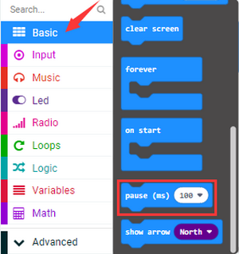

------

**Build blocks**：

------

#### 6.Test Result:

After uploading test code to micro:bit main board and powering on via the USB cable, the LED in (1,0) lights up for 1s and the one in (3,4) shines for 1s.

   [How to download?  How to quick download?](#3.1.3Step 3: 下载代码：) 

### Project 3: LED Dot Matrix

#### 1.Introduction:
Dot matrix gains popularity in our life, such as LED screen, bus station and the mini TV in the lift.

The LED dot matrix of Micro:bit mainboard consists of 25 light emitting diodes. In previous lesson, we control LED of Micro:bit board to form patterns, numbers and character strings by setting the coordinate points. In addition, we may click small squares of LED in a specific code to realize these formation, or display custom patterns on LED dot matrix.

#### 2.Components:

| Micro:bit Mainboard*1 |  |
| --------------------- | ---------------------- |
| Micro USB Cable*1     |  |

#### 3.Connection:
Connect the board to your computer via micro USB cable.

#### 4.Test Code:

**Find code blocks:**：

------

**Build blocks**：

------

#### 5.Test Result:
After uploading test code to micro:bit main board and powering on via the USB cable, the 5*5 dot matrix shows numbers 1, 2, 3, 4 and 5, and then it alternatively shows, “Hello!”, , , ,  and .

​    [How to download?  How to quick download?](#3.1.3Step 3: 下载代码：) 

### Project 4: Programmable Buttons

#### 1.Introduction:
The button can control the on and off of the circuit, which is disconnected when the button is not pressed, but it will be connected as soon as it is pressed. 

Micro:bit board includes three buttons: a reset button on the back and two programmable buttons on the front. Press A, B and AB at the same time respectively, and the corresponding screen displays them respectively.

#### 2.Components:

| Micro:bit Mainboard*1 |  |
| --------------------- | ---------------------- |
| Micro USB Cable*1     |  |

#### 3.Connection:

Connect the board to your computer via micro USB cable.

#### 4.Test Code1:

**Find code blocks:**

------

**Build blocks**：

------

#### 5.Test Result 1:

After uploading test code 1 and powering on with micro USB cable, the 5*5 LED dot matrix shows A if button A is pressed and then release, B if button B is pressed and release, and AB if buttons A and B are pressed together and then release.

   [How to download?  How to quick download?](#3.1.3Step 3: 下载代码：) 

#### 6.Test Code 2:

**Find code blocks**

------

------

------

------

------

**Build blocks**：

------

#### 7.Test Result 2:
After uploading test code 2 and powering on, press button A, the number of rows lit by the LED dot matrix will increase, when B is pressed, the number of rows lit by the LED dot matrix will decrease.

   [How to download?  How to quick download?](#3.1.3Step 3: 下载代码：) 

### Project 5: Temperature Detection

------

#### 1.Introduction: 
The Micro:bit main board is not equipped with a temperature sensor, which uses a nNFR52833 chip for temperature detection. Therefore,  the detected value is much closer to the temperature of the processor,  so there maybe deviation from the ambient value.

Its detection range is -40 ~ 105℃.

#### 2.Components:

| Micro:bit Mainboard*1 |  |
| --------------------- | ---------------------- |
| Micro USB Cable*1     |  |

#### 3.Connection:
Connect the board to your computer via micro USB cable.

------

#### 4.Test Code :

**Find code blocks:**

------

------

------

**Build blocks:**

------

#### 5.Test Result 1:
After uploading test code 1 to micro:bit main board, powering on via the USB cable, and click “**Show console Device**”, the temperature value will be showed in the serial monitor as shown below.

   [How to download?  How to quick download?](#3.1.3Step 3: 下载代码：) 

------

When you touch the processor nNRF52833 on the board for a while, its temperature will rise gradually：

------

If you’re running Windows 7 or 8 instead of Windows 10, Google Chrome won’t be able to match devices. So CoolTerm is needed.

Open CoolTerm and click **Options** to select **SerialPort**, set COM port and put baud rate to 115200 (after testing, the baud rate of USB SerialPort communication on Micro: Bit main board is 115200), and then click **OK** and **Connect**.

------

------

The CoolTerm serial monitor shows the change of temperature in the current environment, as shown below:

------

#### 6.Test Code 2:

**Find code blocks:**

------

------

------

------

**Build blocks:** 35 in the code can be modified according to actual conditions. 

------

#### 7.Test Result 2：

After uploading the code 2 to the board, when the ambient temperature is less than 35℃, the 5*5 LED dot matrix shows. Press the sensor, when the temperature is equal to or greater than 35℃, and thenwill appear.

   [How to download?  How to quick download?](#3.1.3Step 3: 下载代码：) 

### Project 6: Geomagnetic Sensor

------

#### 1.Introduction：

This project aims to explain the use of the Micro: bit geomagnetic sensor, which can not only detect the strength of the geomagnetic field, but it can be used as a compass to determine directions. It is also an important part of the Attitude and Heading Reference System (AHRS).

Micro: Bit main board uses LSM303AGR geomagnetic sensor, which supports standard, fast mode, fast mode plus and high-speed (100 kHz, 400 kHz, 1 MHz and 3.4 MHz) I2C serial bus interface and SPI serial standard interface for external communications, and the magnetic field dynamic range is ±50 gauss. In the board, the magnetometer module is used in both magnetic detection and compass.

In this experiment, the compass will be introduced first, and then the original data of the magnetometer will be checked. The main component of a common compass is a magnetic needle, which can rotate and point to the magnetic north pole under the influence of the geomagnetic field. (which is near the geographic South Pole) to determine directions.

**Attention: this geomagnetic sensor built in the board can help us determine directions by showing readings in the value from 0 to 360. And we need to calibrate it for the first by rotating it. Please note that metal materials around may attenuate the accuracy of the reading  and calibration.**

#### 2.Components:

| Micro:bit Mainboard*1 |  |
| --------------------- | ---------------------- |
| Micro USB Cable*1     |  |

#### 3.Connection:
Connect the board to your computer via micro USB cable.

------

#### 4.Test Code:

**Find code blocks:**

------

------

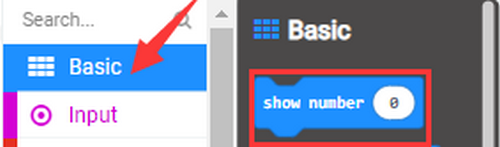

------

**Build blocks:**

------

Note: It is imperative to calibrate the Micro:bit board for different geomagnetic fields exist in different places. And the board requires a calibration for the first using time.

#### 5.Test Result 1：
Upload code 1 and keep USB cable connected. Press button A and LED dot matrix prompts“TILT TO FILL SCREEN”. After tilt Micro:bit board for calibration, 25 LEDs will light up, as shown below: 

A smile iconwill appear after completing calibration. Press button A, and the detected magnetometer value will show. And the direction north, east, south and west corresponds to 0°, 90°, 180° and  270° respectively.

   [How to download?  How to quick download?](#3.1.3Step 3: 下载代码：) 

#### 6.Test Code 2:

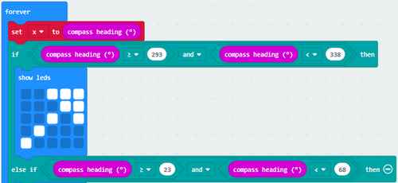

This code is able to maintain the reading for direction distinguishing, and the sign finally points to the current magnetic north pole.

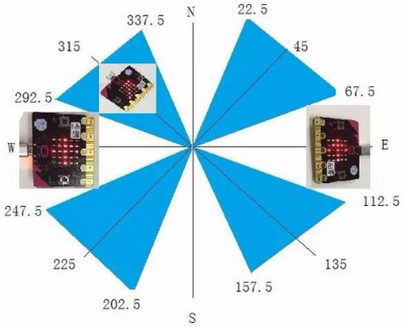

If the value is between 292.5 and 337.5, as shown above, LED dot matrix shows a sign pointing up to the upper right. 0.5 can’t be input in the code, so the values we get are 293 and 338. Now we add other logical judgment conditions to complete this program. 

You can upload the code directly from the tutorial. Or add the code blocks manually:

**Find code blocks:**

------

------

------

------

------

 **Find code blocks:**

 

 

 

#### 7.Test Result 2:
Upload code 2 and keep USB cable connected. After calibration, tilt the Micro:bit board, the LED dot matrix displays the direction signs. 

​    [How to download?  How to quick download?](#3.1.3Step 3: 下载代码：) 

 ### Project 7: Accelerometer

#### 1.Introduction:
The Micro: bit main board boasts a built-in LSM303AGR acceleration sensor  (accelerometer) which includes standard, fast, plus and high-speed mode  (100 kHz, 400 kHz, 1 MHz and 3.4 MHz) of I2C serial bus interface and SPI serial standard interface for external communication, with a resolution of 8/10/12 bits and range of ±2g, ±4g, or ±8g.

When the micro:bit board is at rest or in uniform motion, the  accelerometer only detects the acceleration of gravity. If the board is slightly swung, the detected acceleration is much less than the that of gravity, but the difference can be ignored. Therefore, we mainly detect the change of gravitational acceleration on the x, y, and z axes.

In this project, we will introduce how to measure the position of the board with the accelerometer. And then we will have a look at the original three-axis value output by the accelerometer.

#### 2.Components:

| Micro:bit Mainboard*1 |  |
| --------------------- | ---------------------- |
| Micro USB Cable*1     |  |

#### 3.Connection:
Connect the board to your computer via micro USB cable.

#### 4.Test Code:

**Find code blocks:**

------

------

------

**Build blocks:**

------

#### 5.Test Result 1:
After uploading code 1 and powering on, if we shake the Micro:Bit board(any direction), the LED dot matrix displays the digit “1”.

  [How to download?  How to quick download?](#3.1.3Step 3: 下载代码：) 
When the logo is kept above, number 2 will be displayed.

------

When it is kept upside down(logo below the LED dot matrix), number 3 will be displayed.

------

When the logo is kept above, number 4 will be displayed.

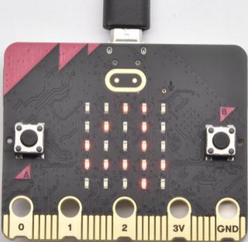

------

When it is covered on the desk, the number 5 exhibits.
When the board is tilted to the left , the LED dot matrix shows the number 6 as shown below.

------

When the board is tilted to the right , the LED dot matrix displays the number 7 as shown below:

------

When the board falls down to the floor(a free fall), the LED dot matrix shows the number 8. (Please note that this test is not recommended for it may damage the main board.)

If you’d like to try this function, you can also set the acceleration to 3g, 6g or 8g. But we do not recommend it.

#### 6.Test Code 2：

**Find code blocks:**

------

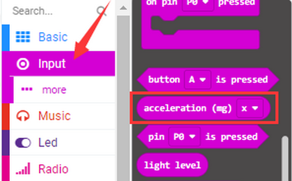

------

------

**Build blocks:**

------

#### 7.Test Result 2：
Upload test code 2 to micro:bit main board, power on via the USB cable, and click “Show console Device”.

  [How to download?  How to quick download?](#3.1.3Step 3: 下载代码：) 

After referring to the MMA8653FC data manual and the hardware schematic diagram, the accelerometer coordinate of the Micro: Bit are shown in the figure below:

The following interface shows the decomposition value of acceleration in X axis, Y axis and Z axis respectively, as well as acceleration synthesis (acceleration synthesis of gravity and other external forces).

If you’re running Windows 7 or 8 instead of Windows 10, via Google  Chrome won’t be able to match devices. You’ll need to use the CoolTerm serial monitor to read value.

Open CoolTerm and click **Options** to select **SerialPort**, and set COM port and baud rate to 115200. Click **OK** and **Connect**. The CoolTerm serial monitor shows the data of X axis, Y axis and Z axis , as shown in the figures below :

### Project 8: Light Intensity

#### 1.Introduction:
In this experiment, we will use the micro:bit board to detect light intensity. Since the micro:bit board does not contain its own photoresistor, the LED dot matrix will shoulder this job. The light signal will convert into input, and the voltage decay time is sampled so that the detected light intensity is a relative value.

#### 2.Components:

| Micro:bit Mainboard*1 |  |
| --------------------- | ---------------------- |
| Micro USB Cable*1     |  |

#### 3.Connection:
Connect the board to your computer via micro USB cable.

#### 4.Test Code:

**Find code blocks:**

------

------

------

------

**Build blocks:**

------

#### 5.Test Result:
Upload test code to micro:bit main board, power on via the USB cable, and click “Show console Device”.

   [How to download?  How to quick download?](#3.1.3Step 3: 下载代码：) 

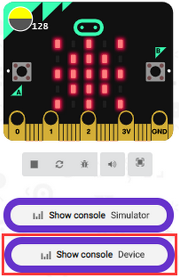

When the LED dot matrix is covered by hand, the light intensity is approximately 0; when the LED dot matrix is exposed to light, the light intensity gets stronger with the light as shown below:

20 in the code is an arbitrary value of light intensity. If the  current light value is less than or equal to 20, the icon moon will appear on the LED dot matrix. If it’s greater than 20, the sun will appear.

If you’re running Windows 7 or 8 instead of Windows 10, Google Chrome won’t be able to match devices. CoolTerm will be required.

Open CoolTerm and click **Options** to select **SerialPort**, and set COM port and baud rate to 115200, click **OK** and **Connect**. The CoolTerm serial monitor shows the value of light intensity, as shown below:

### Project 9: Speaker

#### 1.Introduction：
Micro: Bit board boasts an built-in speaker, which makes sound to the programs easier. It is also able to make sound such as utter giggles,  greetings and yawning as well as all kinds of tones, like playing the song *Ode to Joy*.

You can also turn off the built-in speaker to enjoy the beautiful music via headphones connected to GND and P0. In MakeCode, you need to turn off the speaker by “Turn off built-in speakers” block.

#### 2.Components:

| Micro:bit Mainboard*1 |  |
| --------------------- | ---------------------- |
| Micro USB Cable*1     |  |

#### 3.Connection:
Connect the board to your computer via micro USB cable.

#### 4.Test Code:

**Find code blocks:**

------

------

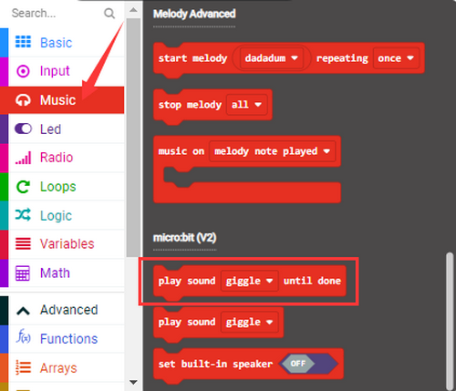

------

**Build blocks:**

------

#### 5.Test Result 1: 
After uploading code 1 and powering on, the speaker utters sound and the LED dot matrix shows the logo of music.

  [How to download?  How to quick download?](#3.1.3Step 3: 下载代码：) 

#### 6.Test Code 2:

**Find code blocks:**

------

------

------

**Build blocks:**

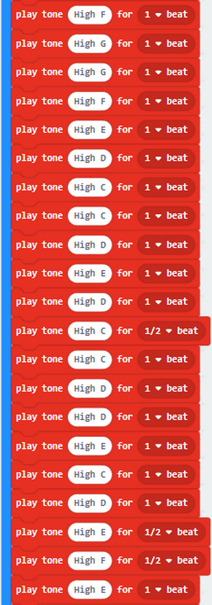

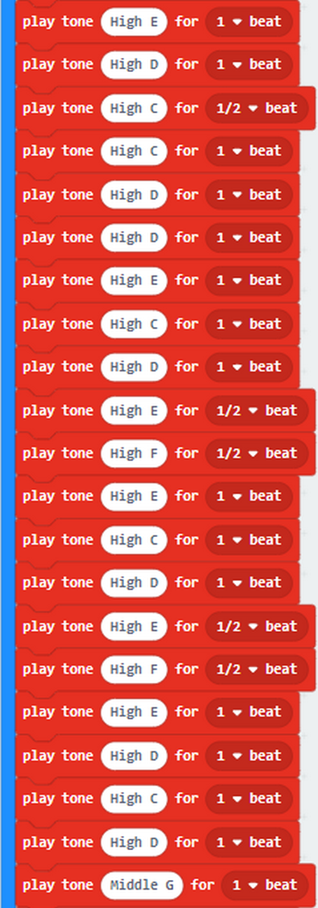

*Ode to Joy*:

For more information about musical notations：<https://en.wikipedia.org/wiki/Numbered_musical_notation>

### Project 10: Touch-sensitive Logo

#### 1. Introduction：
The Micro: bit main board is equipped with a golden touch-sensitive logo, which can act as a button. This capacitive touch sensor senses small changes in the electric field when it is pressed or touched.

#### 2.Components:

| Micro:bit Mainboard*1 |  |
| --------------------- | ---------------------- |
| Micro USB Cable*1     |  |

#### 3.Connection:
Connect the board to your computer via micro USB cable.

#### 4.Test Code:

**Find code blocks:**

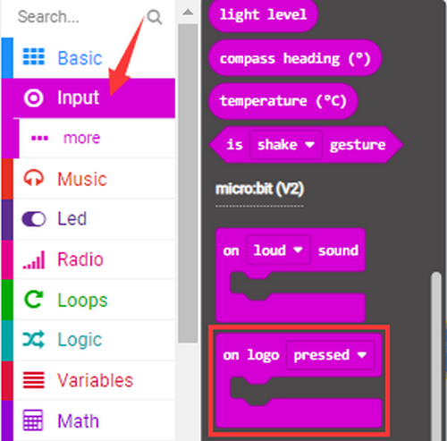

------

------

------

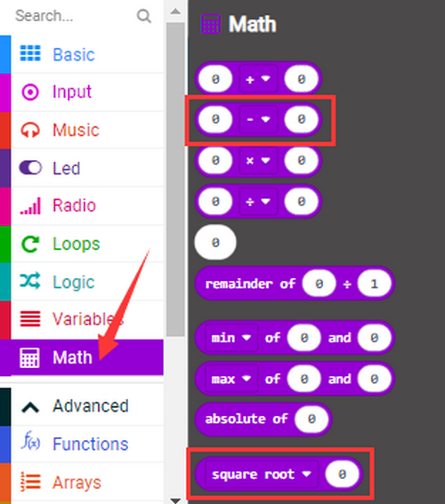

------

------

------

**Build blocks:**

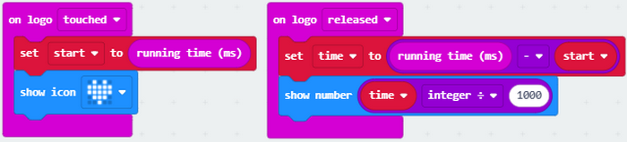

#### 5.Test Result:

After uploading the code and powering on, the LED dot matrix exhibits the heart pattern “❤” when the logo is pressed, and it displays digit when the logo is released. The longer it is pressed, the greater the number is when it is released.

   [How to download?  How to quick download?](#3.1.3Step 3: 下载代码：) 

### Project 11: Microphone

#### 1.Introduction：
The Micro:bit mainboard is built with a microphone, which can test the volume of ambient environment. When you clap, the microphone LED indicator turns on. So, you can make a disco lighting changing with music. The microphone is placed on the opposite side, and an LED  indicator is next to the hole that lets sound pass. When the board detects sound, the LED indicator lights up.

#### 2.Components:

| Micro:bit Mainboard*1 |  |
| --------------------- | ---------------------- |
| Micro USB Cable*1     |  |

#### 3.Connection:
Connect the board to your computer via micro USB cable.

#### 4.Test Code:

**Find code blocks:**

------

------

**Build blocks:**

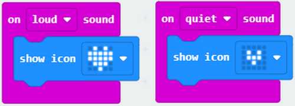

#### 5.Test Result 1：
After uploading test code 1 to micro:bit main board and powering on via the USB cable, the LED dot matrix displays “❤” when you clap, and  appears when it is quiet around.

   [How to download?  How to quick download?](#3.1.3Step 3: 下载代码：) 

#### 6.Test Code 2:

**Find code blocks:**

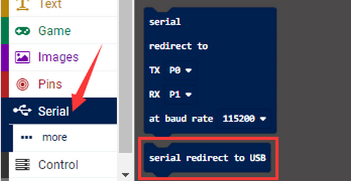

------

------

------

------

------

**Build blocks:**

------

#### 7.Test Result 2：
Upload test code 2 and power on and click “Show console Device” as shown below:

   [How to download?  How to quick download?](#3.1.3Step 3: 下载代码：) 

The louder the sound is, the greater the sound value will show on the serial monitor:

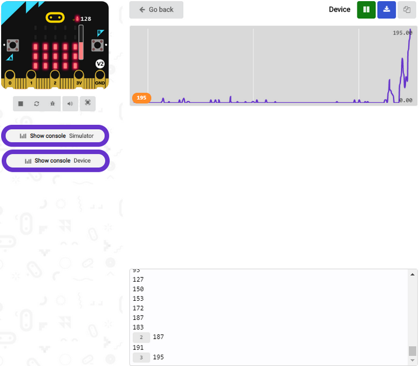

When the button A is pressed, the LED dot matrix displays the value of the biggest volume. Please note that the biggest volume can be reset via the Reset button. When you clap, the LED dot matrix shows the pattern of the sound.

### Project 12: Touch-sensitive Logo Controls Speaker

#### 1. Introduction:
In the previous projects, we have learned about the touch-sensitive logo and the speaker respectively.

In the project, we will combine these two components to play music. We will apply the Logo to control the speaker to sing songs.

#### 2.Components:

| Micro:bit Mainboard*1 |  |
| --------------------- | ---------------------- |
| Micro USB Cable*1     |  |

#### 3.Connection:
Connect the board to your computer via micro USB cable.

#### 4.Test Code:

**Find code blocks:**

------

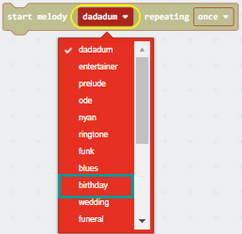

------

------

------

------

**Build blocks:**

------

#### 5.Test Result：
After uploading test code to micro:bit main board and powering on via the USB cable, the speaker plays a *Birthday Song* when the logo is touched.

   [How to download?  How to quick download?](#3.1.3Step 3: 下载代码：) 

### Project 13: Dodge Bullets

#### 1.Introduction:
We have learned about the two programmable buttons: button A and B. In  this project, we will combine them with LED dot matrix to design a game: Dodge Bullets.

#### 2.Components:

| Micro:bit Mainboard*1 |  |
| --------------------- | ---------------------- |
| Micro USB Cable*1     |  |

#### 3.Connection:
Connect the board to your computer via micro USB cable.

#### 4.Test Code:

**Find code blocks:**

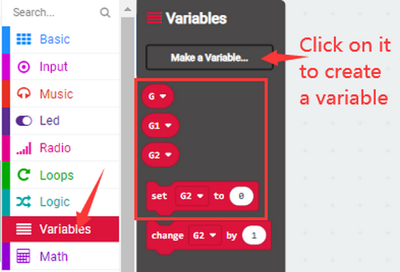

------

------

------

------

------

------

------

------

**Build blocks:**

------

------

#### 6.Test Result1：
The game begins when the code 1 is uploaded to the main board. The bullets fall off and we need to control the role G by Button A and B to shun them. If the role fails to avert the attacks, game is over.

   [How to download?  How to quick download?](#3.1.3Step 3: 下载代码：) 

#### 7.Game 2：
Dodge bullets! Earn points!

#### 8.Test Code 2：

**Find code blocks:**

------

------

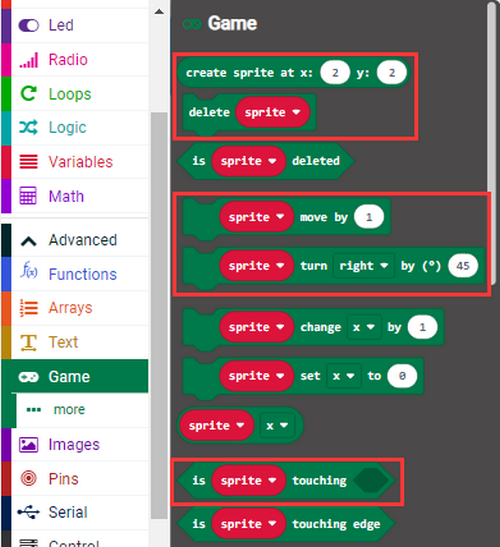

------

------

------

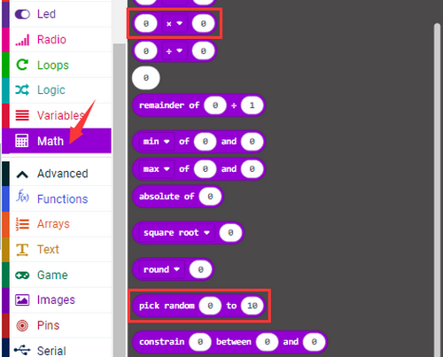

------

------

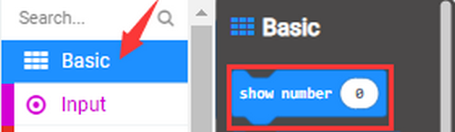

------

------

------

**Build blocks:**

------

------

------

------

#### 9.Test Result 2：
The game begins when the code 2 is uploaded to the main board. The  bullets fall off and we control the role G by Button A and B to shun them. 1 score will be tallied for each successful dodging. If the role fails to avert the attacks, the game is over and scores will be displayed.

   [How to download?  How to quick download?](#3.1.3Step 3: 下载代码：) 

### Project 14: Bluetooth Wireless Communication

#### 1.Introduction:
The Micro:bit main board comes with a nRF52833 processor with a built-in BLE(Bluetooth Low Energy) Bluetooth 5.1 device and a 2.4GHz antenna for Bluetooth wireless communication, so that the board is able to communicate with a variety of Bluetooth devices, including smart phones and tablets.

In this project, we mainly concentrate on the Bluetooth wireless communication to transmit code or signals. Firstly, we should connect a device (a phone or an iPad) to the board.

#### 2.Components:

| Micro:bit Mainboard*1 |    |
| --------------------- | ------------------------ |
| Micro USB Cable*1     |    |
| Smart Phone/IPad*1    |  |

#### 3.Connection:
Connect the board to your computer via micro USB cable.

#### 4.Procedures：

We will demonstrate on iPhone/iPad/MAC devices. Android/Windows devices may take these as a reference.

1. iOS/MAC: <https://www.microbit.org/get-started/user-guide/ble-ios/> 

   Click “Download pairing HEX file” to download the Micro: Bit firmware and upload the downloaded firmware to the Micro: Bit main board(iOS/MAC only).

------

------

------

2. Open App Storeand search “micro bit” and click “”to download the APP.

3. Connect your Apple device with Micro: Bit main board.
  - Turn on Bluetooth on the device.

  - Open  APP, ensure the board is connected to the device and select “Choose micro:bit”to start pairing Bluetooth.
    
    
    
    
    
  - Pair a new micro:bit.
    
    
    
  - Following the instructions to press button A and B at the same time(do not release them until you are told to) and press Reset & Power button for a few seconds. Release the Reset & Power button, you will see a password pattern shows on the LED dot matrix. Now , release buttons A and B and click “Next”.

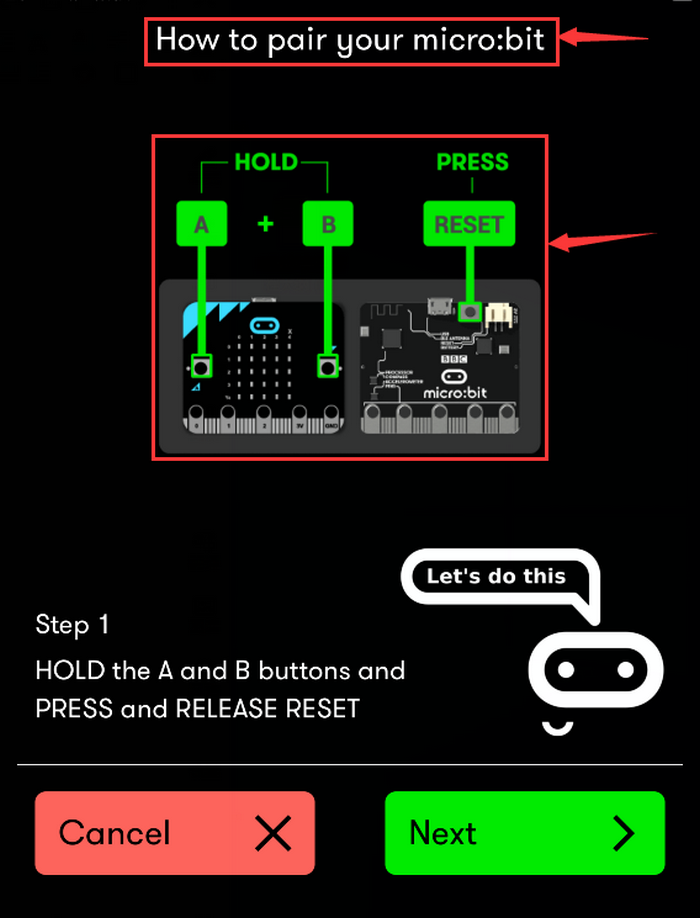

  

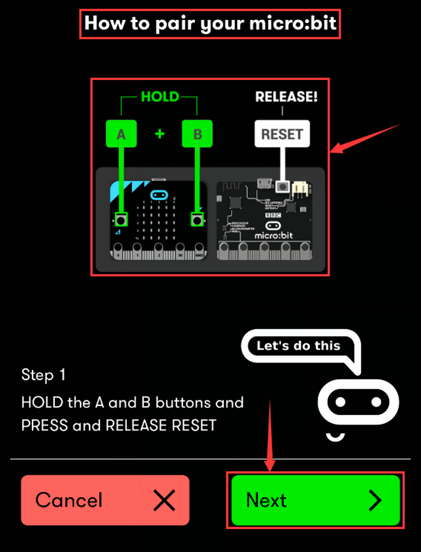

  - Set the password pattern on your Apple device as the same pattern will be showed on the matrix and click “Next”.

  - Still click “Next”and a dialog box props up as shown below. Then click  “Pair”. A few seconds later, the match is done and the LED dot matrix  displays the “√” pattern.

    

    

    

    

    

  -  After the match with Bluetooth, write and upload code with the App.

     1. Click “Create Code” to enter the programming page and write code.（Click ) and you will see，and then select “Create √”.)
     
        
     
        
     
        
     
        
     
     2. Name the project as “1 “and click to save the code.
     
         
     
     3. Click “Flash” to enter the uploading page. The default code program for uploading is the one saved just now and  named “1” and then click “Flash” to upload the code program “1”.
     
        
     
        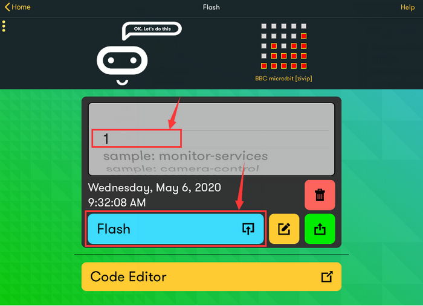
     
        
     
     4. If the program “1” is uploaded successfully a few seconds later, the App will show as below and the LED dot matrix will display a heart pattern.
     
        

------

## 5.Troubleshooting

### 5.1 Code fails to download to Micro:bit

**Problem：** Recently, many users encounter the issue that Micro:bit board doesn’t respond when downloading code.

If the way you operate is correct, maybe you accidentally press the reset button and enter the Maintenance mode or the firmware is lost due  to 

faulty operation.

Plug in Micro:bit board, the “MAINTENANCE” drive appears, which means the program can’t be downloaded.

**Solution：**

1. Download the **hex file** from this page to your computer.

   Down load the latest micro:bit firmware-0255:https://www.microbit.org/get-started/user-guide/firmware/ If you do not want to download from this website, we also provide it in our tutorial.

2. After the latest firmware is downloaded, then drag it into the “MAINTENANCE” to make Micro:bit back to normal mode.

**Avoid to Enter “MAINTENANCE”：**

1. Make sure the Reset button is **not** pressed when plugging the board by USB cable.

      

2. Don’t unplug the cable suddenly during downloading micro:bit program, otherwise, the firmware will be lost and micro:bit will enter  “MAINTENANCE” mode. 
3. In the experiment, wrong wiring also cause short circuit or losing  the firmware.      

------

### 5.2 Troubleshooting-Download with WebUSB

#### 5.2.1Step 1: Check cable

Make sure that your micro:bit is connected to your computer with a micro USB cable. You will see a **MICROBIT** drive appear in Windows Explorer when it’s connected. 

**If you can see the MICROBIT, please go to step 2**.

If not:

- Make sure that the USB cable is working. Does the cable work on another computer? If not, find a different cable to use. Some cables may only provide a power connection and don’t actually transfer data.
- Try another USB port on your computer.
- Is the cable good but you still can’t see the **MICROBIT** drive? Then you might have a problem with your micro:bit.
- Try the additional steps described in the [falut finding](https://support.microbit.org/support/solutions/articles/19000024000-fault-finding-with-a-micro-bit) at microbit.org.
- If this doesn’t help, you can create a [support ticket](https://support.microbit.org/support/tickets/new) to notify the Micro:bit Foundation of the problem. 

------

#### 5.2.2 Step 2: Check firmware version

It’s possible that the firmware version on the micro:bit needs an update. Let’s check:

1. Go to the **MICROBIT** drive.
2. Open the **DETAILS.TXT** file.

Look for the version number.: Version: …

Or **Interface Version: …**

If the version is **0234**, **0241**, **0243**, you need to update the [firmware](https://makecode.microbit.org/device/firmware) on your micro:bit. Go to **Step 3** and follow the upgrade instructions.

If the version is **0249**, **0250** or higher, you have the right firmware, just go to **step 4**.

#### 5.2.3 Step 3: Update firmware

1. Put your micro:bit into **MAINTENANCE Mode**. To do this,  please unplug the USB cable from the micro:bit and then re-connect the USB cable after pressing and holding the reset button. Once you insert the cable, you can release the reset button. You should now see **MAINTENANCE** instead of the **MICROBIT** drive. Also, a yellow LED indicator will stay on.

2. Download firmware .hex file: https://microbit.org/guide/firmware/

3. Drag the file onto the **MAINTENANCE** drive.

4. The yellow LED will flash while the HEX file is copying. After that, the LED will go off and the micro:bit resets. The **MAINTENANCE** drive now changes to **MICROBIT**.

5. The upgrade is complete! You can open the **DETAILS.TXT** file to check the firmware version that matches the one of the **HEX** file you copied.

If you want to know more about connecting the board, MAINTENANCE Mode, and upgrading the firmware, please refer to [Firmware guide](https://microbit.org/guide/firmware/).

#### 5.2.4 Step 4: Check browser version

You may need to update your browser.

Check that your browser version matches one of these: **Android**, **Chrome OS**, **Linux**, **macOS** and **Windows 10 Chrome 65+**.

------

#### 5.2.5 Step 5: Pair device

Once you’ve updated the firmware, open the **Chrome Browser**, go to the editor and click on **Pair Device** in settings.

See [WebUSB](https://makecode.microbit.org/device/usb/webusb) (/ device / usb / webusb) for pairing instructions.

