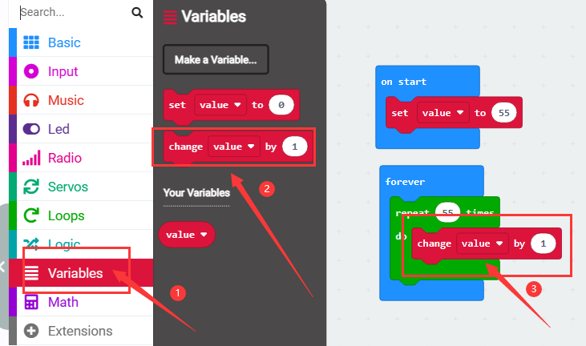
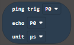
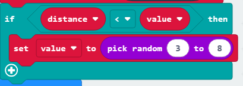

# Micro:bit Hand Biting Crocodile Tutoria

## 1.Servo

### 1.1 Introduction

Servo is a position control rotary actuator. It mainly consists of a housing, a circuit board, a core-less motor, a gear and a position sensor. Its working principle is that the servo receives the signal sent by MCUs or receivers and produces a reference signal with a period of 20ms and width of 1.5ms, then compares the acquired DC bias voltage to the voltage of the potentiometer and obtains the voltage difference output.

In general, servo has three wires: brown, red and orange. The brown wire is grounded, the red one is a positive pole wire and the orange one is a signal  wire.

The rotation angle of servo is controlled by regulating the duty cycle of PWM (Pulse-Width Modulation) signal. The standard cycle of PWM signal is 20ms (50Hz). Theoretically, the width is distributed between 1ms-2ms, but in fact, it's between 0.5ms-2.5ms. The width corresponds the rotation angle from 0° to 180°. 

### 1.2 Specification

Working voltage: DC 3.3V〜5V

Operable angle range: approximately 180° (at 500→2500 μsec)

Pulse width range: 500→2500 μsec

No-load speed: 0.12±0.01 sec/60 (DC 4.8V) 0.1±0.01 sec/60 (DC 6V)

No-load current: 200±20mA (DC 4.8V) 220±20mA (DC 6V)

Stopping torque: 1.3±0.01kg·cm (DC 4.8V) 1.5±0.1kg·cm (DC 6V)

Stop current: ≦850mA (DC 4.8V) ≦1000mA (DC 6V)

Standby current: 3±1mA (DC 4.8V) 4±1mA (DC 6V)

### 1.3 Wiring Diagram

| Expansion Board |    Servo    |
| :-------------: | :---------: |
|       GND       | G（Brown）  |
|       3V3       |  V（Red）   |
|    P1 / io14    | S（Yellow） |

### 1.4 Code

Note: The rotation angle of the servo is 0-180 degrees, but if the crocodile has been assembled, the angle must be rotated between 55-130 degrees, otherwise the servo will get hot and burn out.

**Code File：**

Download link：[Download](.\MakeCode\MicrobitBitingCrocodile.zip)

Download the code file and unzip it, then double-click `microbit-1-Servo_Code1.hex `to open the file and upload the code.

**Add code manually：**

1.Tap  to add servo library.

2.Input “Servo” and click to add Servo library.

3.It is successfully added.

4.Drag into from ，and set the pin to P1 and Angle to 55 °.

5.Dragfrom  and place it under the ，and set the delay to 1000ms.

6.Repeat steps 4 and 5 to add the code blocks to set the servo to 90 °  and 110 ° with a delay of 1000ms.

**Complete Code：**

### 1.5 Test Result

After uploading the code, the crocodile will open its mouth for 1s, then close half of its mouth for 1s, and then completely close its mouth. 

### 1.6 Extended Tutorial

Earlier we have controlled the crocodile to open and close its mouth at a wide angle, so how to control the crocodile to slowly close and open its mouth?

#### 1.6.1 Code

**Code File：**

Download link：[Download](.\MakeCode\MicrobitBitingCrocodile.zip)

Download the code file and unzip it, then double-click `microbit-1-Servo_Code2.hex`to open the file and upload the code.

**Add code manually：**

1.Click in  and add a variable named value.

2.Dragfrom into，and set the value to 55 in the white box.

3.Dragfrom  into，and set the repeat times in the white box to 55.

4.Dragfrom into.

5.Drag and from place it under the，and set pin to P1.

6.Dragfrom and place it in the in the white box of  .

7.Dragfrom  and place it under the ，and set the delay to 30ms.

9.Right-clickand tap Duplicate”.

10.Add the copied code block below ，then modify  "1" in the white box of  to "-1".

**Complete Code：**

#### 1.6.2 Test Result

After uploading the code, the crocodile will slowly open its mouth and then slowly close it.

## 2.Ultrasonic Module

### 2.1 Introduction

The HC-SR04 ultrasonic sensor uses sonar to determine distance to an object like what bats do. It offers excellent non-contact range detection with high accuracy and stable readings in an easy-to-use package. It comes with an ultrasonic transmitter and a receiver.

It is being used in a wide range of electronics projects for creating obstacle detection and distance measuring application as well as various other applications.

### 2.2 Specification

Working voltage:3.3-5V 

Quiescent current: <2mA

Working current: 15mA

Effective angle: <15°

Distance range: 2cm – 400 cm

Accuracy: 0.3 cm

Measuring angle: 30 degrees

Trigger input pulse width: 10 microseconds

### 2.3 Wiring Diagram

| Expansion Board | Module |
| :-------------: | :----: |
|       GND       |   G    |
|       3V3       |   V    |
|    P8 / io4     |  Trig  |
|   P12 / io15    |  Echo  |

### 2.4 Code

Note: The measuring distance of ultrasonic is 2-300cm, but after being assembled on the crocodile, it can only detect 4-30cm. For the ultrasonic receives the bounced signal at a certain angle, but the basswood board of the crocodile body blocks it. As a result, only 30cm can be recognized, but this does not affect our hand biting crocodile tutorial.

**Code File：**

Download link：[Download](.\MakeCode\MicrobitBitingCrocodile.zip)

Download the code file and unzip it, then double-click `microbit-2-Ultrasonic_Code.hex`to open the file and upload the code.

**Add code manually：**

1.Tapto add sonar library.

2.Input “sonar”and clickto add sonar library.

3.The sonar library is added.

4.Dragfrom into .

5.Click in  and add a variable named value.

6.Dragfrom into.

7.Dragfrom  into the white box of ，and set trig to P8 pin, echo to P12 pin, unit to CM.

8.Dragfrom  and place it under the ，and modify the character in the first white box to "distance=".

9.Dragfrom and place it into the second white box of.

10.Dragfrom and place it under the ，and modify the delay to 500ms.

**Complete Code：**

### 2.5 Test Result

If you cannot print data in the browser's makecode compilation interface, use CoolTerm software. Details are in the micro bit basic tutorial.

After uploading the code, open the CoolTerm software, click Options, select SerialPort, set the COM port and baud rate to 115200 (after testing, the USB serial communication baud rate of the micro:bit board is 115200), then click OK and Connect.

After the setting is completed, we can see the distance sensed by the ultrasonic in the serial port printing area. The serial port printing distance will be printed every 0.5s.

## 3.Buttons Control the Crocodile 

### 3.1 Introduction

In this project, we work to control the crocodile to open and close its mouth through the AB buttons on the microbit.

### 3.2 Code

**Code File：**

Download link：[Download](.\MakeCode\MicrobitBitingCrocodile.zip)

Download the code file and unzip it, then double-click `microbit-3-Key_controlled_crocodile_Code .hex` to open the file and upload the code.

**Add code manually：**

1.Add servo library  then dragfrom and place it into，and set the pin to P1 and the angle to 110°.

2.Dragfrom and place it into，and set the dot matrix to display.

3.Dragfrom , then add the set servo to 55 ° code and the dot matrix displayscode.

4.Copyand alter button to B，then set servo angle to 110°，dot matrix displays.

**Complete Code：**

### 3.3 Test Result

After the code is uploaded successfully, press the button A and the crocodile will display and close its mouth. Press the button B and the crocodile will displayand open its mouth. 

## 4.Hand Biting Crocodile

### 4.1 Introduction

The crocodile opens its mouth. When you put your hand into the crocodile's mouth, the ultrasonic on the crocodile will measure the depth of your hand into the crocodile's mouth. When it reaches the depth we set, the crocodile will bite.

### 4.2 Code

**Code File：**

Download link：[Download](.\MakeCode\MicrobitBitingCrocodile.zip)

Download the code file and unzip it, then double-click `microbit-4-Crocodile_Bite_Code.hex ` to open the file and upload the code.

**Add code manually：**

1.Add the servo library and the ultrasonic library, and generate variables "distance" and "value".

2.Add into.

2.Addinto，and set variable to ‘distance’.

3.Addinto，and set trig to P8 pin, echo to P12 pin, unit to CM.

4.Dragfrom and place it under the .

5.Dragfrom and place it under the diamond box of .

6.Addto the left box of ，to the right box of；distance < value.

7.Addinto .

8.Dragfrom into，and set the value to 3 to 8.

9.Add code in，first, set the servo to 55°，dot matrix displays ，and delays 3s，then set the servo to 110°，dot matrix displaysand delays 1s.

**Complete Code：**

### 4.3 Test Result

After the code is successfully uploaded, the crocodile opens its mouth, and the RGB dot matrix displays a green smile. When the distance between the hand and the ultrasonic meets the crocodile's bite conditions, the crocodile bites and the RGB dot matrix displays a red crying face. The crocodile releases its mouth after 3s of bite. And the RGB dot matrix displays a green smiley face, the final 1s delay is to prepare for retracting the hand from the crocodile's mouth. After 1s, it enters the next hand-biting process.

