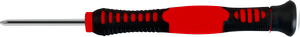

 **Thank you for choosing keyestudio!**

 **We will endeavor to provide you with better products and services!**

------

**About keyestudio**

Keyestudio is the best-selling brand owned by KEYES Corporation. Our product contains Arduino development boards, expansion boards, sensors and  modules, Raspberry Pi, micro:bit expansion boards as well as smart cars and learning kits, which can help customers at any level to learn about  Arduino.

Notably, all of our products are in line with international quality standards and are greatly appreciated in a broad menu of different markets across the world.

Welcome to check out more contents from our official website:

[http://www.keyestudio.com](http://www.keyestudio.com)

------

**Obtain Information and After-sales Service**

1. Download address：[Click on the link to download](./Codes.zip)
2. If something is found missing or broken, or you have some difficulty learning the kit, please feel free to contact us. Welcome to  send email to us: [service@keyestudio.com](http://m.138.gz.cn/webadmin/~CAmsnCrrNXhTAySKCerrIfWjjZuuWVfI/~/usr/mod_edituser.jsp?;uid=service@keyestudio.com;;clearCache=)
3. We will endeavor to update projects and products continuously from your sincere advice! Thanks!

------

**Warning**

1. This product contains tiny pin headers, so please keep out of reach of children under 7 to prevent from lacerations.
2. This product also contains conductive parts(control board and  electronic modules). Please operate according to the requirements of tutorials. Otherwise, improper operation may damage parts due to overheating. In this case, do not touch it and immediately disconnect the circuit power.

------

**Copyright**

The Keyestudio trademark and logo are the copyright of **KEYES DIY ROBOT co.,LTD**. All products under Keyestudio brand can’t be copied, sold or resold without authorization by anyone or any company.

If you are interested in our products, please contact to our sales representatives：[fennie@keyestudio.com](http://m.138.gz.cn/webadmin/~CAmsnCrrNXhTAySKCerrIfWjjZuuWVfI/~/usr/mod_edituser.jsp?;uid=fennie@keyestudio.com;;clearCache=)

------

# STEM Programming DIY Crocodile Learning Kit

## 1.Mind Mapping

------

## 2.Kit List

|  #   |                           Picture                            |         Component         | QTY  |
| :--: | :----------------------------------------------------------: | :-----------------------: | :--: |
|  1   |                                        |      Basswood Board       |  1   |
|  2   |                                      |      Expansion Board      |  1   |
|  3   |                                      |           Servo           |  1   |
|  4   |                                      |      Battery Holder       |  1   |
|  5   |              |          M4 Nut           |  4   |
|  6   |  |       M4*6mm Screw        |  4   |
|  7   |              | M2.5*8MM Flat Head Screw  |  2   |
|  8   |              |         M2.5 Nut          |  2   |
|  9   |              | M1.4*8MM Round Head Screw |  4  |
|   10   |  |               M1.4  Nut               |   4    |
|    11  |  | M1.2*5MM Round Head Self-tapping Screw |   4    |
|   12   |            |           M2*12MM Round Head Screw           |   2    |
|   13   |            |                M2  Nut                |   2    |
|  14  |                                       |        Screwdriver        |  1   |

------

## 3.Introduction

In this product, we seek to use basswood boards to create a crocodile kit, which combines hardware, software as well as actuators.

The crocodile kit uses an ultrasonic module, a servo and the sensors on the micro:bit mainboard or ESP32 Easy Coding Board, which is quite intriguing. Importantly, with a graphical programming software, writing code is as easy as stacking blocks, and we are able to develop logical thinking ability during play.

------

## 4.Features  

1. **Environment-friendly:** This kit adopts environment-friendly materials, which are green and sustainable.
2. **Easy assembly:** The assembly process is very easy.
3. **Intriguing:** You will enjoy the fun of the crocodile projects.
4. **Multiple programming methods:** It boasts Makcode and KidsBlock programming methods, which significantly meets diversified programming needs.

------

## **5.Link for Basic Tutorial（Development board and programming software）**

The basic tutorial includes an introduction to the development board, how to use programming software, how to burn code, and how to use onboard sensors and modules. 

Note：If you are a novice, learn the basic tutorial for the corresponding development board (Micro:bit / ESP32 Easy Coding Board) first, so that you will learn how to use programming software and upload code.

Micro:bit Development Board Basic Tutorial： [Micro:bit Basic Tutorial](Microbit/MicrobitBasicTutoria.md)

ESP32 Easy Coding Board Basic Tutorial：[ESP32 Easy Coding Board Basic Tutorial](ESP32/ESP32EasyCodingBoardBasicTutorial.md)

------

## 6.Product Assembly

Note: Please learn the basic tutorial corresponding to the development board before assembling it.

###  step 1: Assemble the Expansion Board

Required components

1. Align the expansion board with the holes in the basswood board, then fix it with screws.

------

2. Complete

------

### step 2: Assemble the Battery Holder

Required components

1.Align the battery holder with the holes in the basswood board, then fix it with screws (pay attention to the big hole next to the screw hole when assembling, which is used to pass the wire of the battery holder).

2. Complete

------

### step 3: Assemble the Ultrasonic Module Ultrasonic Module

Required components

------

1.Align the ultrasonic module with the holes in the basswood board, then fix it with screws.

2. Complete

------

### step 4: Assemble the Tail

Required components

1.Assemble two parallel basswood boards to the left tail. 

2.Assemble the right tail to the parallel basswood board. 

3.

4.

### step 5: Crocodile Head

Required components

1.First, assemble the crocodile’s eyes.

Note: When assembling, pay attention to the direction of the bottom plate. The bigger one is on the left, as shown below.

2.

Note: Please confirm the direction of the basswood boards on both sides according to the picture below.

3.

4.

------

### step 6: Assemble the Servo

 Required components

1.Place the servo into the groove and align the two screw holes.

Note: Please confirm the servo direction according to the picture below.

2.Use M2x12 screws and M2 nuts to fix the servo to the basswood board.

3.Set the current angle of the servo to 90 degrees.

Note: Remember to set the servo angle, otherwise the servo may be burned out.

3.1 Wiring Diagram

**The brown wire of the servo corresponds to GND, the red wire corresponds to 3V3, and the yellow color corresponds to S on the board.**

| Expansion board |      Servo       |
| :-------------: | :--------------: |
|       GND       | G（Brown wire）  |
|       3V3       |  V（Red wire）   |
|      io16       | S（Yellow wire） |

**ESP32 Easy Coding Board:**

**Code：**

Link for setting the servo to 90 degrees of ESP32 Easy Coding Board：[Tap it to download the code](code\ESP32EasyCodingBoardBiting\SetTheServoTo90Degrees.sb3)

After the code is uploaded successfully, the servo will first rotate to 0 degrees and then rotate to 90 degrees.

**Micro:bit:**

**Code：**

Link for setting the servo to 90 degrees of Micro:bit Board：[Tap it to download the code](code\Microbit\SetTheServoTo90Degrees.hex)

After the code is uploaded successfully, the servo will first rotate to 0 degrees and then rotate to 90 degrees.

4.

5.

Note：Set the angle of the servo to 90 degrees.

### step 7: Overall Assembly

7.1

7.2 

Note: Connect the wires before assembling the basswood board.

7.3

7.4

7.5

7.6

7.7

7.8 Wiring 

Servo

| Expansion board | Servo |
| :-------------: | :---: |
|       GND       |   G   |
|       3V3       |   V   |
|    P9 / io16    |   S   |

Ultrasonic Module

Pay attention to the color of the ultrasonic connecting wire.

| Expansion board |    Module     |
| :-------------: | :-----------: |
|       GND       |  G（Black）   |
|       3V3       |   V（Red ）   |
|    P8 / io4     | Trig（White） |
|   P12 / io15    | Echo（Brown） |

Power Port                                                                                                                                                                                                                                                                                                                                                                                                                                                 

7.9 Assemble the tail: Connect the wires before assembling the tail.

7.10 Assemble the latch

7.11 Product Display

------

## 7.Tutorial Link

In the crocodile tutorial, you will learn how to drive the servo according to the development board and read the ultrasonic distance, and then combine the two modules to achieve the effect of hand biting crocodile.

Link for Micro:bit Development Board Crocodile Tutorial：[Biting Crocodile Micro:bit Tutorial](Microbit/MicrobitBitingCrocodileTutorial.md)

Link for ESP32 Easy Coding Board Tutorial：[Biting Crocodile ESP32 Easy Coding Board Tutorial](ESP32/ESP32EasyCodingBoardBitingCrocodileTutorial.md)

------

## 8.Resources

[https://www.keyestudio.com/](https://www.keyestudio.com/)

[https://wiki.keyestudio.com/Main_Page](https://wiki.keyestudio.com/Main_Page)

[Micro:bit Educational Foundation | micro:bit (microbit.org)](https://microbit.org/)

<https://tech.microbit.org/hardware/>

<https://microbit.org/new-microbit/>

<https://www.microbit.org/get-started/user-guide/overview/>

<https://microbit.org/get-started/user-guide/features-in-depth/>

[https://www.espressif.com/](https://www.espressif.com/)

------

